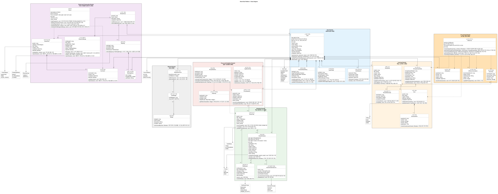
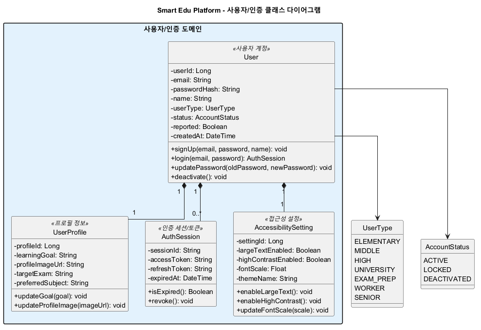
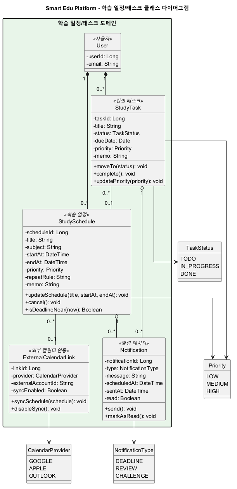
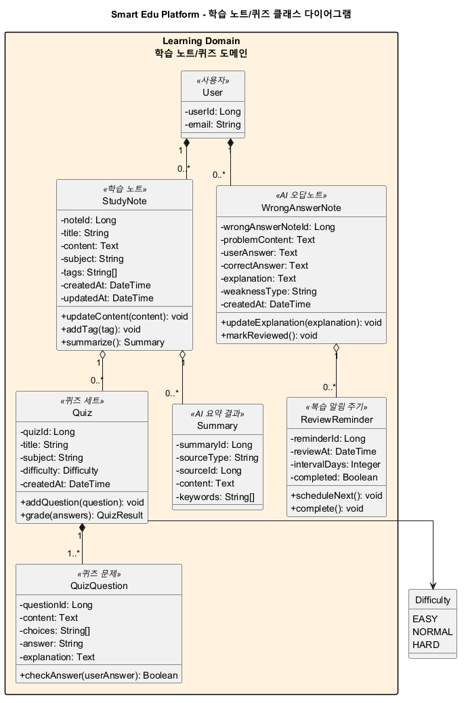
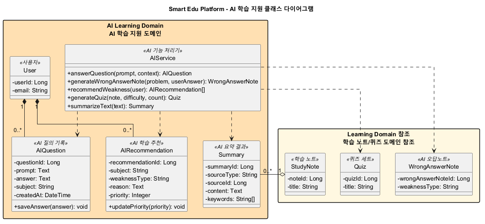
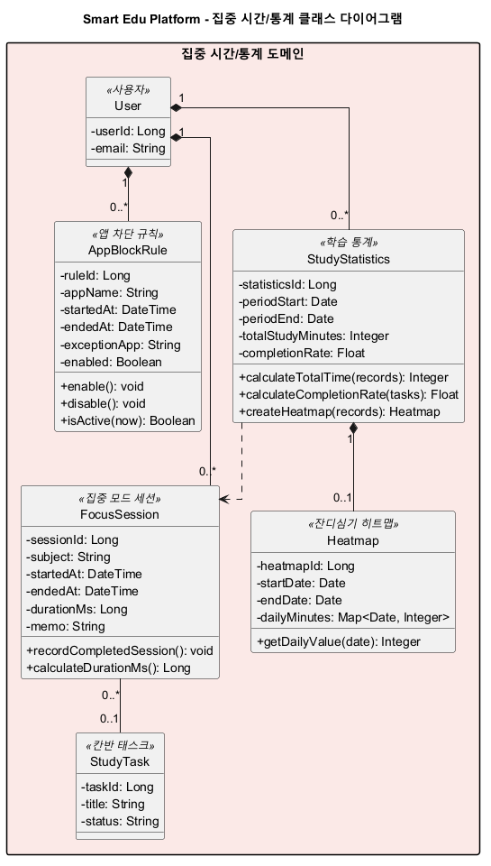
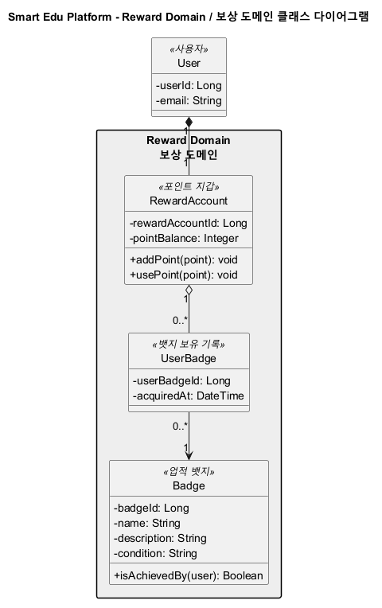

# Smart Edu Platform 클래스 다이어그램

문서 연결:
- 상위 문서: [설계 문서](./design-document.md)
- 관련 부록:
  - [아키텍처 개요](./architecture-overview.md)
  - [시퀀스 다이어그램](./sequence-diagram.md)
  - [2단계 구현 계획 문서](./implementation-plan.md)

---

## 목차

1. [문서 개요](#1-문서-개요)
2. [설계 범위](#2-설계-범위)
3. [클래스 다이어그램](#3-클래스-다이어그램)
4. [도메인별 분할 클래스 다이어그램](#4-도메인별-분할-클래스-다이어그램)
5. [주요 클래스 설명](#5-주요-클래스-설명)
6. [설계 의도](#6-설계-의도)

---

## 1. 문서 개요

본 문서는 Smart Edu Platform의 주요 도메인 객체와 객체 간 관계를 UML 클래스 다이어그램으로 정의한 설계 문서이다.

요구사항 문서의 기능 요구사항 `FR-01`부터 `FR-29`까지를 기준으로, 실제 구현 시 핵심이 되는 사용자, 학습 일정, 태스크, 노트, AI 학습 지원, 커뮤니티, 학습 통계, 보상, 접근성, 관리자 기능을 중심으로 클래스를 구성하였다.

다이어그램 작성 도구는 **PlantUML**을 기준으로 한다.

- 전체 다이어그램 구현 코드: [plantuml/class-diagram.puml](plantuml/class-diagram.puml)
- 전체 렌더링 이미지: [../../screenshots/class-diagram/class-diagram.png](../../screenshots/class-diagram/class-diagram.png)
- 도메인별 분할 다이어그램: `docs/design/plantuml/class-diagram-*.puml`, `screenshots/class-diagram/class-diagram-*.png`

본 다이어그램은 AI 도구를 활용하여 PlantUML 코드 초안을 생성한 뒤, 조원 검토를 거쳐 수정하고 PNG 이미지로 렌더링하였다. PlantUML 원본은 `docs/design/plantuml/`에 보관하며, 렌더링된 이미지는 `screenshots/`에 보관한다.

---

## 2. 설계 범위

본 클래스 다이어그램은 다음 기능 영역을 포함한다.

| 기능 영역 | 관련 요구사항 |
|---|---|
| 사용자 인증 및 프로필 | `FR-01`, `FR-02`, `FR-28` |
| 학습 일정 및 태스크 관리 | `FR-03`, `FR-04`, `FR-05`, `FR-22` |
| 학습 노트/퀴즈 및 복습 알림 | `FR-06`, `FR-08`, `FR-10`, `FR-19`, `FR-26` |
| AI 학습 지원 | `FR-07`, `FR-08`, `FR-09`, `FR-10`, `FR-19` |
| 커뮤니티 및 소셜 학습 | `FR-11`, `FR-12`, `FR-13`, `FR-27`, `FR-29` |
| 집중 및 시간 관리 | `FR-14`, `FR-15`, `FR-16`, `FR-17` |
| 음성 학습 및 접근성 | `FR-18`, `FR-19`, `FR-20`, `FR-21`, `FR-26` |
| 보상 및 사용자 유형별 UI | `FR-23`, `FR-24`, `FR-25` |

---

## 3. 클래스 다이어그램

전체 클래스 다이어그램은 7개 도메인 객체와 관계를 한 장에 담은 개요용 다이어그램임. 세부 구조는 도메인별 분할 다이어그램에서 확인함.

다이어그램 구현 코드는 [plantuml/class-diagram.puml](plantuml/class-diagram.puml)에 보관한다.

---

## 4. 도메인별 분할 클래스 다이어그램

| 도메인 | 설명 | 이미지 | 원본 |
|---|---|---|---|
| 사용자/인증 | 사용자 계정, 프로필, 인증 세션, 접근성 설정 구조 | [class-diagram-auth.png](../../screenshots/class-diagram/class-diagram-auth.png) | [class-diagram-auth.puml](plantuml/class-diagram-auth.puml) |
| 학습 일정/태스크 | 학습 일정, 칸반 태스크, 알림, 외부 캘린더 연동 구조 | [class-diagram-schedule-task.png](../../screenshots/class-diagram/class-diagram-schedule-task.png) | [class-diagram-schedule-task.puml](plantuml/class-diagram-schedule-task.puml) |
| 학습 노트/퀴즈 | 학습 노트, 오답노트, 복습 알림, 퀴즈, 요약 결과 저장 구조 | [class-diagram-learning.png](../../screenshots/class-diagram/class-diagram-learning.png) | [class-diagram-learning.puml](plantuml/class-diagram-learning.puml) |
| AI 학습 지원 | AI 질의, 학습 추천, AI 서비스 처리기, 학습 도메인 객체 생성 의존 구조 | [class-diagram-ai-learning.png](../../screenshots/class-diagram/class-diagram-ai-learning.png) | [class-diagram-ai-learning.puml](plantuml/class-diagram-ai-learning.puml) |
| 커뮤니티/챌린지/관리자 | 게시판, 댓글, 스터디 챌린지, 랭킹, 관리자 처리 구조 | [class-diagram-community-admin.png](../../screenshots/class-diagram/class-diagram-community-admin.png) | [class-diagram-community-admin.puml](plantuml/class-diagram-community-admin.puml) |
| 집중 시간/통계 | 집중 세션, 앱 차단 규칙, 학습 통계, 히트맵 구조 | [class-diagram-focus-statistics.png](../../screenshots/class-diagram/class-diagram-focus-statistics.png) | [class-diagram-focus-statistics.puml](plantuml/class-diagram-focus-statistics.puml) |
| 보상 | 포인트 지갑, 업적 뱃지, 사용자 뱃지 보유 기록 구조 | [class-diagram-reward.png](../../screenshots/class-diagram/class-diagram-reward.png) | [class-diagram-reward.puml](plantuml/class-diagram-reward.puml) |

### 4.1 사용자/인증

### 4.2 학습 일정/태스크

### 4.3 학습 노트/퀴즈

### 4.4 AI 학습 지원

### 4.5 커뮤니티/챌린지/관리자

### 4.6 집중 시간/통계

### 4.7 보상

---

## 5. 주요 클래스 설명

| 클래스 | 설명 | 관련 요구사항 |
|---|---|---|
| `User` | 회원가입, 로그인, 계정 상태 및 제재 여부를 관리하는 사용자 핵심 클래스 | `FR-01`, `FR-02`, `FR-28` |
| `UserProfile` | 학습 목표, 프로필 이미지, 선호 과목 등 사용자 부가 정보를 관리 | `FR-02`, `FR-23` |
| `StudySchedule` | 캘린더 기반 학습 일정을 표현 | `FR-03`, `FR-22` |
| `StudyTask` | 칸반 보드의 할 일, 진행 중, 완료 상태를 표현 | `FR-04` |
| `Notification` | 마감일, 복습, 챌린지 등 알림을 표현 | `FR-05`, `FR-26` |
| `StudyNote` | 학습 노트 작성, 수정, 요약의 기준 객체 | `FR-06`, `FR-19` |
| `Quiz`, `QuizQuestion` | AI 또는 노트 기반으로 생성되는 복습 퀴즈와 문제 | `FR-10` |
| `WrongAnswerNote` | 오답 문제, 사용자 답변, 해설, 취약 유형을 관리 | `FR-08` |
| `ReviewReminder` | 오답노트 기반 복습 알림 주기를 관리 | `FR-26` |
| `AIService` | AI 질의, 오답노트 생성, 추천, 퀴즈 생성, 요약을 담당하는 서비스 | `FR-07`, `FR-08`, `FR-09`, `FR-10`, `FR-19` |
| `FocusSession` | 클라이언트에서 측정한 최종 순공 시간을 `durationMs` 단위로 저장하는 집중 세션 기록 | `FR-15` |
| `AppBlockRule` | 공부 시간 동안 차단할 앱과 예외 조건을 관리 | `FR-14` |
| `StudyStatistics`, `Heatmap` | 학습 시간, 진척도, 히트맵 데이터를 계산하고 표현 | `FR-16`, `FR-17` |
| `StudyGroup`, `StudyChallenge`, `Ranking` | 그룹 학습, 챌린지, 주간 랭킹을 관리 | `FR-11`, `FR-12`, `FR-29` |
| `BoardPost`, `Comment`, `Admin` | 게시판과 전반적인 운영 관리(사용자, 챌린지 제재 등) 기능을 표현 | `FR-13`, `FR-27`, `FR-28`, `FR-29` |
| `AccessibilitySetting` | 큰 글씨, 고대비, 글자 크기 설정을 관리 | `FR-20` |
| `RewardAccount`, `Badge`, `UserBadge` | 포인트, 뱃지, 보상 기능을 표현 | `FR-24` |

---

## 6. 설계 의도

- 사용자 기능은 `User`를 중심으로 구성하고, 프로필, 접근성 설정, 보상 계정은 1:1 관계로 분리하였다.
- 학습 일정과 태스크는 서로 독립적으로 사용할 수 있지만, 필요하면 일정에 태스크를 연결할 수 있도록 설계하였다.
- AI 관련 기능은 `AIService`에 집중시키고, 생성 결과는 `AIQuestion`, `WrongAnswerNote`, `AIRecommendation`, `Quiz`, `Summary` 같은 도메인 객체로 저장되도록 설계하였다.
- 커뮤니티 기능은 게시글과 댓글을 분리하고, 관리자 기능은 신고된 게시글과 댓글을 관리하는 방식으로 표현하였다.
- 학습 시간 기록과 통계는 `FocusSession`을 원천 데이터로 사용하고, `durationMs`를 화면 표시와 통계 계산 시 분/시간 단위로 변환하는 구조로 설계하였다.
- 확장성을 고려하여 사용자 유형, 태스크 상태, 게시판 카테고리, 알림 유형 등은 열거형으로 분리하였다.

---

## 관련 산출물

- [문서 부록 인덱스](../README.md)
- [최종보고서](../final-report/final-report-draft.md)
- [요구사항 문서](../requirements/requirements-document.md)
- [API 명세](../api/api-spec.md)
- [테스트 보고서](../test-report/test-report.md)
- [구현 계획](./implementation-plan.md)
