# Smart Edu Platform 설계 문서

## 문서 정보

| 항목 | 내용 |
|---|---|
| 과목 | 소프트웨어공학 |
| 조 | 15조 |
| 프로젝트명 | Smart Edu Platform |
| 선정 주제 | 주제 1. 개인화된 학습 관리 앱 |
| 조원 | 정이량, 황대겸, 박지환 |
| 작성일 | 2026년 05월 |
| 문서 버전 | v1.0 |

---

## 목차

1. 문서 개요
2. 시스템 아키텍처 개요
3. 주요 모듈 설계
4. 클래스 다이어그램
5. 시퀀스 다이어그램
6. 외부 시스템 연동 설계
7. 데이터베이스 설계 방향
8. AI 활용 및 다이어그램 생성 방식
9. 부록 문서
10. 설계 문서 요약

---

## 1. 문서 개요

본 문서는 Smart Edu Platform의 시스템 구조와 주요 설계 요소를 설명하는 통합 설계 문서이다.

Smart Edu Platform은 다양한 연령대와 학습 목적을 가진 사용자를 위한 개인화 학습 관리 앱으로, 학습 일정 관리, 노트 및 퀴즈 관리, AI 기반 학습 지원, 학습 데이터 시각화, 커뮤니티 및 관리자 기능을 제공하는 것을 목표로 한다.

본 설계 문서는 `docs/requirements/requirements-document.md`의 기능 요구사항, 비기능 요구사항, 유스케이스 목록을 기준으로 작성되었다. 아키텍처 개요, 클래스 다이어그램, 시퀀스 다이어그램은 모두 요구사항 문서의 `FR`, `NFR`, `UC` ID 체계를 따르며, 2단계 구현에서 프론트엔드, 백엔드, 데이터베이스, API 구조를 구체화하기 위한 기준 자료로 활용된다.

---

## 2. 시스템 아키텍처 개요

Smart Edu Platform은 Web/Mobile 기반 개인화 학습 관리 플랫폼으로 설계한다. 전체 구조는 사용자가 접근하는 클라이언트, 핵심 비즈니스 로직을 처리하는 백엔드 서버, 학습 및 사용자 데이터를 저장하는 DBMS, AI 기능을 담당하는 AI 시스템, 외부 일정 연동을 담당하는 외부 캘린더 시스템으로 구성된다.

### 2.1 클라이언트-서버 구조

클라이언트는 사용자 화면, 입력 이벤트, 기본 UI 상태 관리를 담당한다. 백엔드 서버는 인증, 학습 일정, 노트, AI 연동, 통계, 커뮤니티, 관리자 기능 등 핵심 도메인 로직을 처리한다.

2단계 구현 기준 기술 스택은 React Native + Expo 기반 클라이언트와 Node.js + Express 기반 백엔드 서버로 확정한다. 인증은 JWT + bcrypt를 사용하고, API는 REST 방식으로 제공한다.

### 2.2 계층형 구조

백엔드 서버는 다음과 같은 계층형 구조를 기준으로 설계한다.

| 계층 | 주요 역할 |
|---|---|
| Presentation / Controller 계층 | 클라이언트 요청 수신, 입력 검증, 응답 반환 |
| Service 계층 | 회원가입, 일정 관리, AI 학습 지원, 통계 계산 등 비즈니스 로직 처리 |
| Repository 계층 | 데이터베이스 접근, 데이터 저장 및 조회 |
| External Integration 계층 | AI 시스템, 외부 캘린더 API 등 외부 시스템 연동 |

이 구조는 요구사항 변경 시 특정 계층만 수정할 수 있도록 하며, 테스트와 유지보수성을 높이기 위한 기준이 된다.

### 2.3 3-Tier 구성

| 구분 | 적용 기술 | 설명 |
|---|---|---|
| Client Tier | React Native + Expo | 모바일 중심 UI와 사용자 입력 처리 |
| Application Server Tier | Node.js + Express | 인증, 비즈니스 로직, REST API 제공 |
| Database Tier | PostgreSQL + Prisma | 사용자, 일정, 학습 기록, 커뮤니티 데이터 저장 |

DBMS는 PostgreSQL 단일 DB를 기준으로 설계한다. 사용자 계정, 일정, 게시판, 학습 기록 등 관계형 데이터는 일반 테이블로 관리하고, AI 응답, 퀴즈 선택지, 추천 결과처럼 구조가 유동적인 데이터는 PostgreSQL의 JSON/JSONB 필드와 Prisma `Json` 타입을 활용한다. MongoDB와 복수 DB 구성은 초기 후보로 검토했으나 2단계 MVP 범위에서는 사용하지 않는다.

---

## 3. 주요 모듈 설계

주요 모듈은 요구사항 문서의 기능 요구사항 `FR-01`부터 `FR-29`까지를 기준으로 구분한다.

| 모듈 | 주요 역할 | 관련 요구사항 |
|---|---|---|
| 사용자 관리 모듈 | 회원가입, 로그인, 사용자 프로필 관리, 사용자 계정 관리 및 제재 | FR-01, FR-02, FR-28 |
| 학습 일정/태스크 모듈 | 학습 일정, 칸반 보드, 마감일 알림, 외부 캘린더 연동 | FR-03, FR-04, FR-05, FR-22 |
| 학습 노트 모듈 | 학습 노트 작성, 수정, 삭제, 조회 | FR-06 |
| AI 학습 지원 모듈 | AI 질의, 오답노트, 학습 추천, 퀴즈 생성, 학습 내용 요약 | FR-07, FR-08, FR-09, FR-10, FR-19 |
| 커뮤니티 모듈 | 주간 학습 랭킹, 스터디 챌린지, 게시판, 게시판 관리, 챌린지 관리 | FR-11, FR-12, FR-13, FR-27, FR-29 |
| 집중/통계 모듈 | 앱 차단, 순공 시간 측정, 학습 통계, 히트맵 | FR-14, FR-15, FR-16, FR-17 |
| 음성/접근성 모듈 | TTS, STT, 큰 글씨, 고대비, 초등학생 친화 UI, 복습 알림 | FR-18, FR-20, FR-21, FR-25, FR-26 |
| 보상 모듈 | 퀘스트, 뱃지, 포인트 관리 | FR-24 |
| 사용자 유형 모듈 | 사용자 유형별 기능 제공 | FR-23 |

비기능 요구사항은 각 모듈의 품질 기준으로 반영한다. 예를 들어 사용자 관리 모듈은 비밀번호 암호화와 개인정보 보호를 위해 `NFR-02`, `NFR-03`을 고려하고, 외부 API 및 AI 연동 기능은 응답성, 안정성, 데이터 신뢰성을 위해 `NFR-01`, `NFR-12`를 고려한다.

---

## 4. 클래스 다이어그램

클래스 다이어그램은 요구사항 문서의 기능 요구사항 `FR-01`부터 `FR-29`까지를 기준으로 구성하였다. 핵심 도메인은 사용자, 학습 일정, 태스크, 노트, AI 학습 지원, 커뮤니티, 학습 통계, 보상, 접근성, 관리자 기능으로 구분한다.

전체 클래스 다이어그램은 모든 도메인 객체와 관계를 한 번에 보여주는 개요용 다이어그램이다. 전체 구조는 넓게 배치되어 있으므로, 세부 클래스와 관계는 아래 도메인별 분할 다이어그램을 함께 확인한다.

### 4.1 전체 클래스 다이어그램

| 항목 | 링크 |
|---|---|
| 이미지 | [screenshots/class-diagram.png](../../screenshots/class-diagram.png) |
| 원본 | [docs/design/plantuml/class-diagram.puml](./plantuml/class-diagram.puml) |

---

### 4.2 사용자/인증 클래스 다이어그램

사용자 계정, 프로필, 인증 세션, 접근성 설정처럼 사용자 기본 정보와 인증에 연결되는 구조를 보여주는 다이어그램임.

| 항목 | 링크 |
|---|---|
| 이미지 | [screenshots/class-diagram-auth.png](../../screenshots/class-diagram-auth.png) |
| 원본 | [docs/design/plantuml/class-diagram-auth.puml](./plantuml/class-diagram-auth.puml) |

---

### 4.3 학습 일정/태스크 클래스 다이어그램

학습 일정, 칸반 태스크, 알림, 외부 캘린더 연동 구조를 보여주는 다이어그램임.

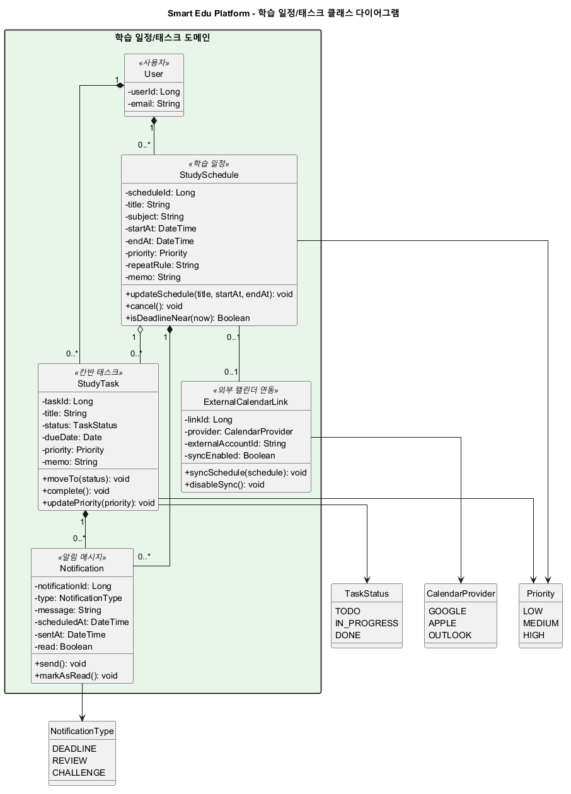

| 항목 | 링크 |
|---|---|
| 이미지 | [screenshots/class-diagram-schedule-task.png](../../screenshots/class-diagram-schedule-task.png) |
| 원본 | [docs/design/plantuml/class-diagram-schedule-task.puml](./plantuml/class-diagram-schedule-task.puml) |

---

### 4.4 노트/퀴즈/AI 클래스 다이어그램

학습 노트, AI 질의, 오답노트, 학습 추천, 퀴즈, 요약 결과 저장 구조를 보여주는 다이어그램임.

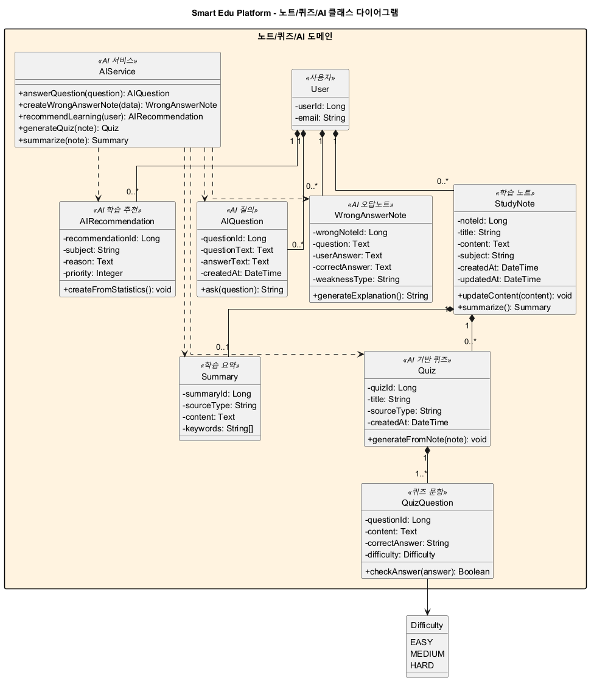

| 항목 | 링크 |
|---|---|
| 이미지 | [screenshots/class-diagram-notes-ai.png](../../screenshots/class-diagram-notes-ai.png) |
| 원본 | [docs/design/plantuml/class-diagram-notes-ai.puml](./plantuml/class-diagram-notes-ai.puml) |

---

### 4.5 커뮤니티/챌린지/관리자 클래스 다이어그램

게시판, 댓글, 스터디 그룹, 스터디 챌린지, 랭킹, 관리자 처리 구조를 보여주는 다이어그램임.

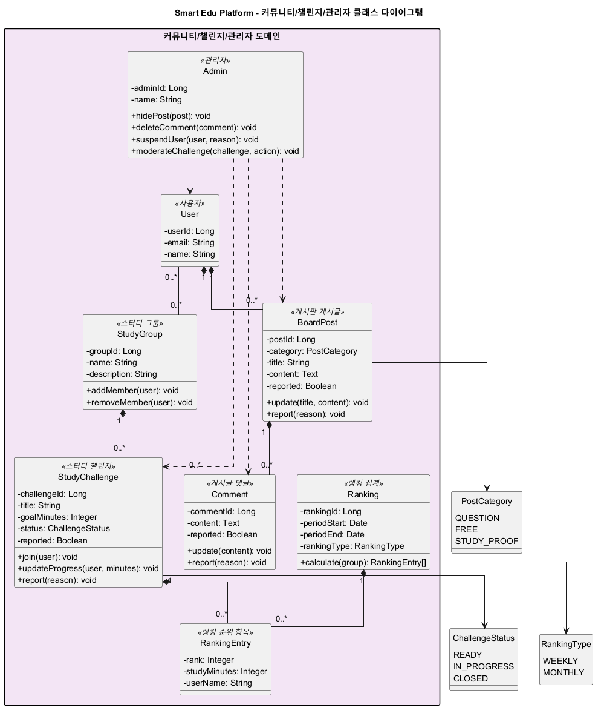

| 항목 | 링크 |
|---|---|
| 이미지 | [screenshots/class-diagram-community-admin.png](../../screenshots/class-diagram-community-admin.png) |
| 원본 | [docs/design/plantuml/class-diagram-community-admin.puml](./plantuml/class-diagram-community-admin.puml) |

---

### 4.6 집중 시간/통계 클래스 다이어그램

집중 세션, 앱 차단 규칙, `durationMs` 기반 학습 시간 기록, 학습 통계와 히트맵 구조를 보여주는 다이어그램임.

| 항목 | 링크 |
|---|---|
| 이미지 | [screenshots/class-diagram-focus-statistics.png](../../screenshots/class-diagram-focus-statistics.png) |
| 원본 | [docs/design/plantuml/class-diagram-focus-statistics.puml](./plantuml/class-diagram-focus-statistics.puml) |

---

### 4.7 주요 클래스 설명

| 클래스 | 주요 역할 | 관련 요구사항 |
|---|---|---|
| `User` | 회원가입, 로그인, 계정 상태 및 제재 여부 관리 | FR-01, FR-02, FR-28 |
| `UserProfile` | 학습 목표, 프로필 이미지, 사용자 유형 등 부가 정보 관리 | FR-02, FR-23 |
| `StudySchedule` | 캘린더 기반 학습 일정 표현 | FR-03, FR-22 |
| `StudyTask` | 칸반 보드의 할 일, 진행 중, 완료 상태 관리 | FR-04 |
| `Notification` | 마감일, 복습, 챌린지 알림 표현 | FR-05, FR-26 |
| `StudyNote` | 학습 노트 작성, 수정, 삭제, 요약 기준 객체 | FR-06, FR-19 |
| `AIService` | AI 질의, 오답노트 생성, 추천, 퀴즈 생성, 요약 기능 처리 | FR-07, FR-08, FR-09, FR-10, FR-19 |
| `WrongAnswerNote` | 오답 문제, 사용자 답변, 해설, 취약 유형 관리 | FR-08 |
| `Quiz`, `QuizQuestion` | AI 또는 노트 기반 복습 퀴즈와 문제 관리 | FR-10 |
| `FocusSession` | 클라이언트에서 측정한 최종 순공 시간을 `durationMs` 단위로 저장 | FR-15 |
| `StudyStatistics`, `Heatmap` | 학습 시간, 진척도, 히트맵 데이터 계산 및 표현 | FR-16, FR-17 |
| `StudyGroup`, `StudyChallenge`, `Ranking` | 그룹 학습, 챌린지, 주간 랭킹 관리 | FR-11, FR-12, FR-29 |
| `BoardPost`, `Comment`, `Admin` | 게시판, 댓글, 신고 처리, 관리자 운영 기능 표현 | FR-13, FR-27, FR-28, FR-29 |
| `AccessibilitySetting` | 큰 글씨, 고대비, 글자 크기 등 접근성 설정 관리 | FR-20 |
| `RewardAccount`, `Badge`, `UserBadge` | 포인트, 뱃지, 사용자 보상 기능 표현 | FR-24 |

클래스 다이어그램은 구현 단계에서 엔티티, 서비스, 저장소 계층을 구체화하기 위한 기준으로 활용한다. 단, 실제 클래스명과 속성은 DBMS 및 백엔드 프레임워크 최종 선택에 따라 일부 조정될 수 있다.

---

## 5. 시퀀스 다이어그램

시퀀스 다이어그램은 요구사항 문서의 유스케이스 `UC-01`부터 `UC-21`까지를 기준으로 주요 기능 흐름을 정리한다. 각 다이어그램은 사용자 또는 관리자의 요청이 클라이언트, 컨트롤러, 서비스, 저장소, DBMS, 외부 시스템을 거쳐 처리되는 흐름을 나타낸다.

UC-12 집중 모드는 클라이언트에서 타이머를 실행하고, 학습 종료 시점에 `POST /api/focus-sessions`로 완료된 집중 세션 기록을 저장하는 방식으로 설계한다. 서버는 진행 중인 타이머 상태를 관리하지 않으며, 저장된 `durationMs` 값은 화면 표시와 통계 계산 시 분/시간 단위로 변환한다.

PlantUML 원본은 `docs/design/plantuml/sequence-diagrams.puml`에 통합 보관하며, 렌더링된 이미지는 `screenshots/sequence-diagram/`에 보관한다.

전체 시퀀스 이미지는 `docs/design/sequence-diagram.md`와 `screenshots/sequence-diagram/`에서 확인한다. 본문에는 구현 기준을 이해하는 데 필요한 대표 흐름만 삽입한다.

### 5.1 주요 시퀀스 다이어그램 목록

| 유스케이스 | 주요 흐름 | 이미지 |
|---|---|---|
| UC-01, UC-02 | 회원가입, 로그인, 인증 실패 처리 | [screenshots/sequence-diagram/UC01-02_SignUpLogin.png](../../screenshots/sequence-diagram/UC01-02_SignUpLogin.png) |
| UC-03 | 학습 일정 등록, 마감 알림, 외부 캘린더 연동 | [screenshots/sequence-diagram/UC03_CreateSchedule.png](../../screenshots/sequence-diagram/UC03_CreateSchedule.png) |
| UC-04 | 칸반 태스크 상태 변경, 완료 시 알림 취소 | [screenshots/sequence-diagram/UC04_UpdateTaskStatus.png](../../screenshots/sequence-diagram/UC04_UpdateTaskStatus.png) |
| UC-05, UC-06, UC-07 | AI 학습 질의, AI 오답노트 생성, 학습 추천 | [screenshots/sequence-diagram/UC05-07_AILearning.png](../../screenshots/sequence-diagram/UC05-07_AILearning.png) |
| UC-09, UC-21 | 스터디 챌린지 참여 및 관리자 챌린지 관리 | [screenshots/sequence-diagram/UC09-21_StudyChallenge.png](../../screenshots/sequence-diagram/UC09-21_StudyChallenge.png) |
| UC-10, UC-18 | 게시판 이용 및 관리자 게시판 관리 | [screenshots/sequence-diagram/UC10-18_BoardAndAdmin.png](../../screenshots/sequence-diagram/UC10-18_BoardAndAdmin.png) |
| UC-11 | 학습 통계 및 히트맵 조회 | [screenshots/sequence-diagram/UC11_ViewStudyStatistics.png](../../screenshots/sequence-diagram/UC11_ViewStudyStatistics.png) |
| UC-12 | 집중 모드 및 순공 시간 측정 | [screenshots/sequence-diagram/UC12_FocusMode.png](../../screenshots/sequence-diagram/UC12_FocusMode.png) |
| UC-13 | TTS 학습 및 요약 보기 | [screenshots/sequence-diagram/UC13_TTSAndSummary.png](../../screenshots/sequence-diagram/UC13_TTSAndSummary.png) |
| UC-14, UC-16 | 접근성 설정 및 초등학생 친화 UI 적용 | [screenshots/sequence-diagram/UC14-16_UISettings.png](../../screenshots/sequence-diagram/UC14-16_UISettings.png) |
| UC-15 | 퀘스트 및 보상 확인 | [screenshots/sequence-diagram/UC15_QuestAndReward.png](../../screenshots/sequence-diagram/UC15_QuestAndReward.png) |
| UC-17 | 복습 알림 확인 | [screenshots/sequence-diagram/UC17_ReviewNotification.png](../../screenshots/sequence-diagram/UC17_ReviewNotification.png) |
| UC-19 | AI 기반 퀴즈 생성 | [screenshots/sequence-diagram/UC19_GenerateQuiz.png](../../screenshots/sequence-diagram/UC19_GenerateQuiz.png) |
| UC-20 | 사용자 계정 관리 및 제재 | [screenshots/sequence-diagram/UC20_UserAccountAdmin.png](../../screenshots/sequence-diagram/UC20_UserAccountAdmin.png) |

---

### 5.2 회원가입 및 로그인

`UC-01`, `UC-02`는 사용자가 계정을 생성하고 로그인하는 흐름을 나타낸다. 백엔드에서는 사용자 입력값 검증, 비밀번호 암호화, 인증 토큰 발급을 수행한다.

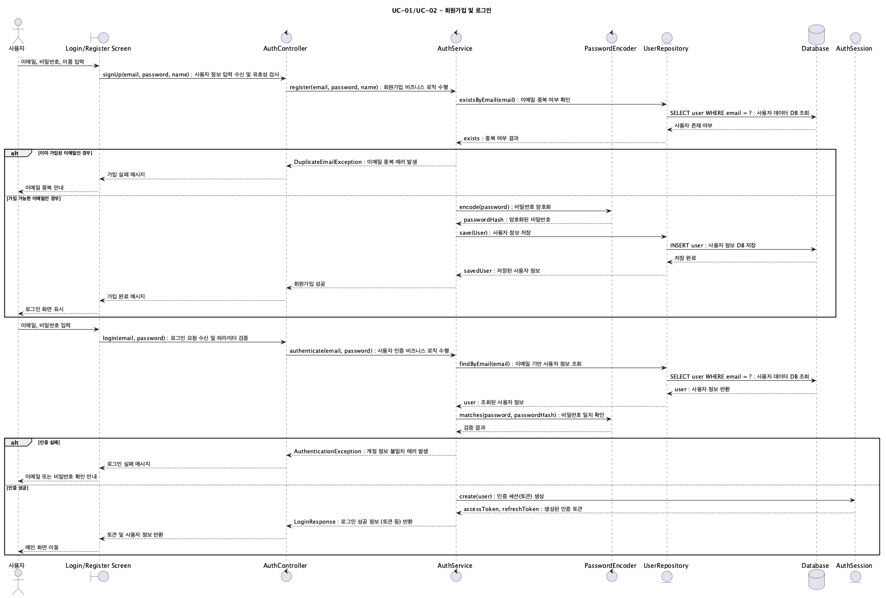

| 항목 | 링크 |
|---|---|
| 이미지 | [screenshots/sequence-diagram/UC01-02_SignUpLogin.png](../../screenshots/sequence-diagram/UC01-02_SignUpLogin.png) |
| 원본 | [docs/design/plantuml/sequence-diagrams.puml](./plantuml/sequence-diagrams.puml) |

---

### 5.3 학습 일정 관리

`UC-03`은 사용자가 학습 일정을 등록하고, 시스템이 마감 알림과 외부 캘린더 연동을 처리하는 흐름을 나타낸다.

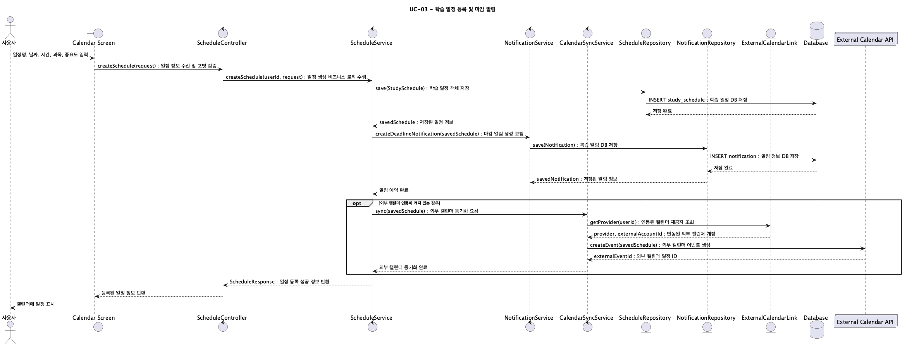

| 항목 | 링크 |
|---|---|
| 이미지 | [screenshots/sequence-diagram/UC03_CreateSchedule.png](../../screenshots/sequence-diagram/UC03_CreateSchedule.png) |
| 원본 | [docs/design/plantuml/sequence-diagrams.puml](./plantuml/sequence-diagrams.puml) |

---

### 5.4 칸반 보드 관리

`UC-04`는 학습 태스크의 상태를 할 일, 진행 중, 완료로 변경하고 관련 알림을 갱신하는 흐름을 나타낸다.

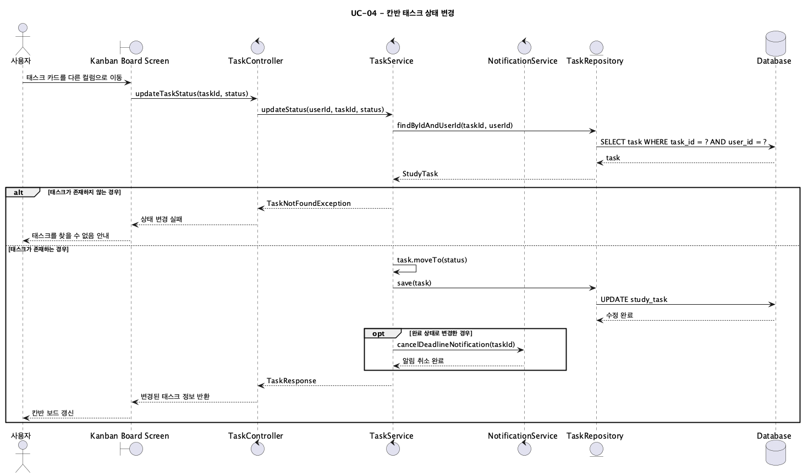

| 항목 | 링크 |
|---|---|
| 이미지 | [screenshots/sequence-diagram/UC04_UpdateTaskStatus.png](../../screenshots/sequence-diagram/UC04_UpdateTaskStatus.png) |
| 원본 | [docs/design/plantuml/sequence-diagrams.puml](./plantuml/sequence-diagrams.puml) |

---

### 5.5 AI 학습 질의, 오답노트, 학습 추천

`UC-05`, `UC-06`, `UC-07`은 AI 시스템을 통해 학습 질의, 오답 분석, 학습 추천을 처리하는 흐름이다. AI 결과는 사용자 학습 데이터와 연결되어 저장된다.

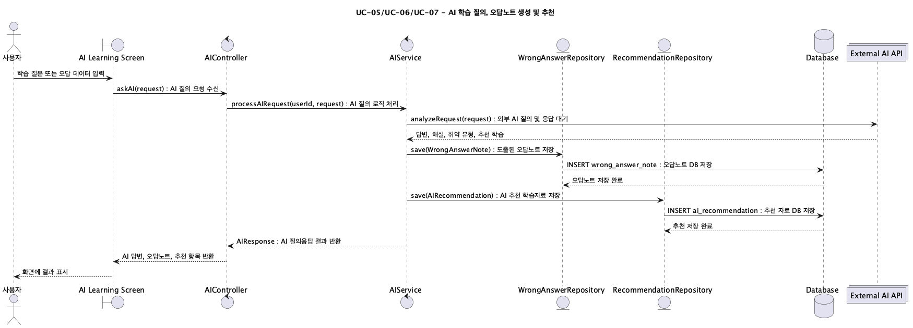

| 항목 | 링크 |
|---|---|
| 이미지 | [screenshots/sequence-diagram/UC05-07_AILearning.png](../../screenshots/sequence-diagram/UC05-07_AILearning.png) |
| 원본 | [docs/design/plantuml/sequence-diagrams.puml](./plantuml/sequence-diagrams.puml) |

---

### 5.6 AI 기반 퀴즈 생성

`UC-19`는 사용자의 학습 노트 또는 오답 데이터를 기반으로 AI 시스템이 복습용 퀴즈를 생성하는 흐름을 나타낸다.

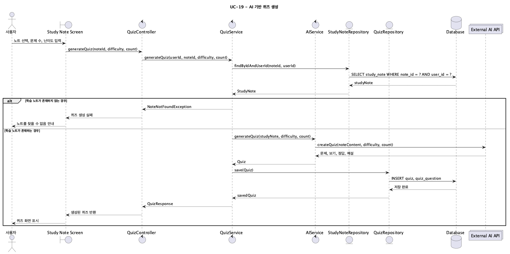

| 항목 | 링크 |
|---|---|
| 이미지 | [screenshots/sequence-diagram/UC19_GenerateQuiz.png](../../screenshots/sequence-diagram/UC19_GenerateQuiz.png) |
| 원본 | [docs/design/plantuml/sequence-diagrams.puml](./plantuml/sequence-diagrams.puml) |

---

### 5.7 게시판 및 관리자 기능

`UC-10`, `UC-18`은 사용자의 게시판 이용과 관리자의 게시판 운영 처리를 나타낸다. 신고된 게시글과 댓글은 관리자 검토 후 처리된다.

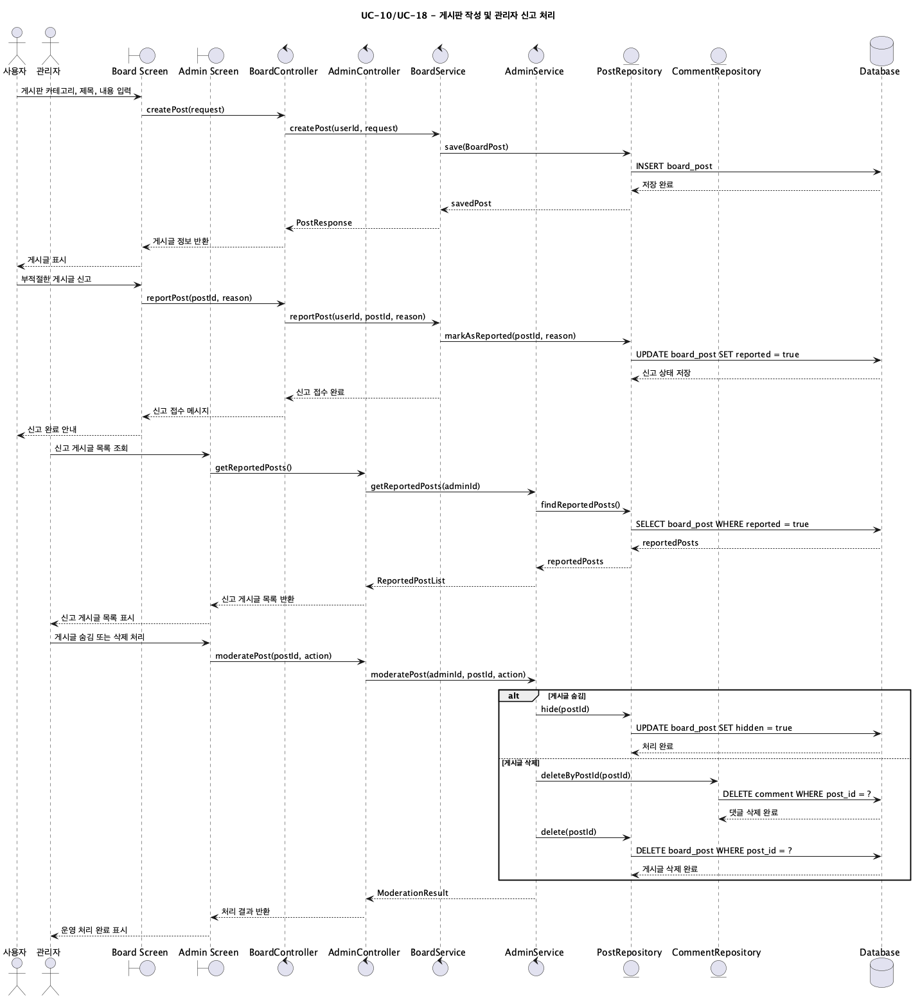

| 항목 | 링크 |
|---|---|
| 이미지 | [screenshots/sequence-diagram/UC10-18_BoardAndAdmin.png](../../screenshots/sequence-diagram/UC10-18_BoardAndAdmin.png) |
| 원본 | [docs/design/plantuml/sequence-diagrams.puml](./plantuml/sequence-diagrams.puml) |

---

### 5.8 학습 통계 확인

`UC-11`은 사용자의 학습 기록을 기반으로 학습 시간, 완료율, 히트맵을 계산하고 조회하는 흐름을 나타낸다.

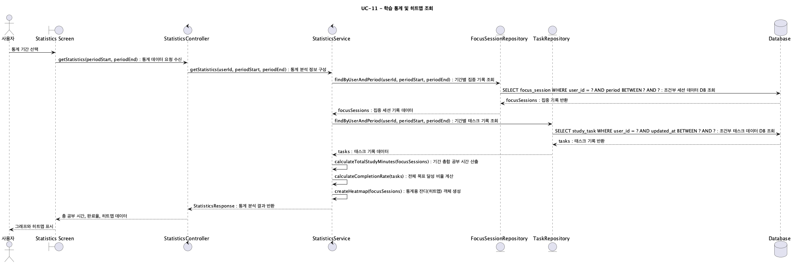

| 항목 | 링크 |
|---|---|
| 이미지 | [screenshots/sequence-diagram/UC11_ViewStudyStatistics.png](../../screenshots/sequence-diagram/UC11_ViewStudyStatistics.png) |
| 원본 | [docs/design/plantuml/sequence-diagrams.puml](./plantuml/sequence-diagrams.puml) |

---

### 5.9 집중 모드 및 순공 시간 측정

`UC-12`는 클라이언트에서 타이머를 실행하고, 종료 시점에 최종 누적 시간만 서버로 전송하는 흐름을 나타낸다. 서버는 완료된 집중 세션 기록을 `durationMs` 기준으로 저장한다.

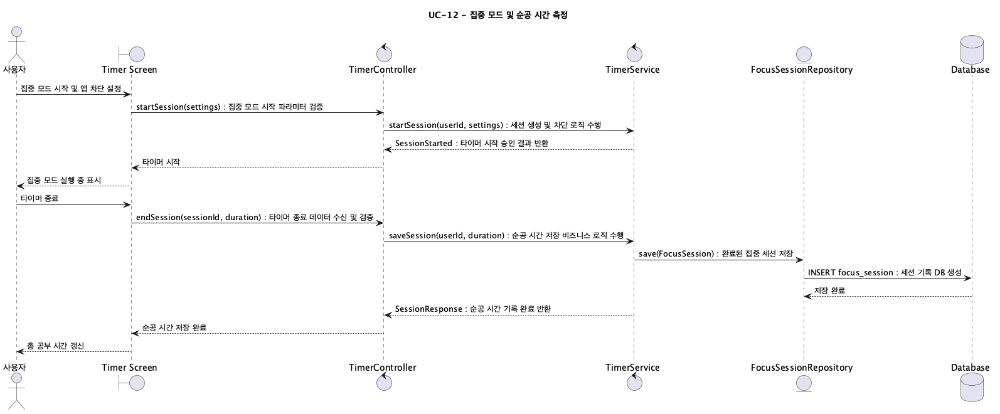

| 항목 | 링크 |
|---|---|
| 이미지 | [screenshots/sequence-diagram/UC12_FocusMode.png](../../screenshots/sequence-diagram/UC12_FocusMode.png) |
| 원본 | [docs/design/plantuml/sequence-diagrams.puml](./plantuml/sequence-diagrams.puml) |

---

## 6. 외부 시스템 연동 설계

Smart Edu Platform은 요구사항 문서의 부액터인 AI 시스템과 외부 캘린더 시스템을 통해 핵심 기능을 확장한다.

### 6.1 AI 시스템 연동

AI 시스템은 다음 기능을 지원하는 외부 또는 내부 AI 서비스로 설계한다.

| 기능 | 관련 유스케이스 | 관련 요구사항 |
|---|---|---|
| AI 학습 질의 | UC-05 | FR-07 |
| AI 오답노트 생성 | UC-06 | FR-08 |
| 학습 추천 받기 | UC-07 | FR-09 |
| 학습 내용 요약 | UC-13 | FR-19 |
| AI 기반 퀴즈 생성 | UC-19 | FR-10 |

백엔드 서버는 사용자의 질문, 학습 노트, 오답 데이터 등을 AI 시스템에 전달하고, 반환된 결과를 사용자 학습 데이터와 연결하여 저장한다. AI 응답이 오래 걸릴 수 있으므로 비동기 처리와 로딩 상태 안내를 고려한다.

### 6.2 외부 캘린더 시스템 연동

외부 캘린더 시스템은 `UC-03 학습 일정 관리`와 연결된다. Google Calendar, Apple Calendar, Outlook Calendar API 등을 후보로 검토할 수 있으며, 사용자의 동의를 받은 뒤 학습 일정을 외부 캘린더와 동기화하는 방식으로 설계한다.

외부 캘린더 연동은 민감한 권한을 요구할 수 있으므로 사용자 동의 기반 권한 요청(`NFR-07`)과 개인정보 보호(`NFR-03`)를 함께 고려한다.

---

## 7. 데이터베이스 설계 방향

2단계 구현 기준 DBMS는 PostgreSQL로 확정한다. 사용자 계정, 학습 일정, 태스크, 게시판, 학습 기록 등 관계형 데이터가 많기 때문에 PostgreSQL 단일 DB를 기본 저장소로 사용한다.

AI 응답 결과, 문제 유형, 퀴즈 선택지, 추천 결과처럼 구조가 유동적인 데이터는 PostgreSQL의 JSON/JSONB 필드와 Prisma `Json` 타입으로 관리한다. MongoDB와 복수 DB 구성은 초기 후보로 검토했으나, 구현 복잡도와 테스트 부담을 줄이기 위해 2단계 MVP에서는 제외한다.

| 데이터 영역 | 설명 |
|---|---|
| 사용자 데이터 | 계정, 프로필, 권한, 사용자 유형 |
| 학습 일정 데이터 | 일정, 태스크, 마감일, 알림, 외부 캘린더 연동 정보 |
| 학습 콘텐츠 데이터 | 노트, 퀴즈, 퀴즈 문항, 오답노트 |
| 학습 기록 데이터 | 순공 시간, 학습 통계, 히트맵 |
| AI 결과 데이터 | AI 답변, 추천 결과, 요약 결과, 생성된 퀴즈 |
| 커뮤니티 데이터 | 게시글, 댓글, 랭킹, 스터디 챌린지 |
| 관리자 데이터 | 사용자 제재, 게시판 관리, 챌린지 관리 기록 |

DB 스키마는 `docs/design/implementation-plan.md`의 API 목록, DB 테이블 초안, ERD 관계를 기준으로 구체화한다. 구현 단계에서는 요구사항 문서의 기능 요구사항과 시퀀스 다이어그램의 흐름을 기준으로 Prisma schema와 migration을 관리한다.

---

## 8. AI 활용 및 다이어그램 생성 방식

본 설계 문서의 UML 다이어그램은 AI 도구를 활용하여 PlantUML 코드 초안을 생성한 뒤, 조원 검토를 거쳐 수정하고 PNG 이미지로 렌더링하였다.

AI 활용 과정의 세부 요약은 [AI 시뮬레이션 로그](../requirements/ai-simulation-log.md)에서 확인 가능함.

다이어그램 작성 및 관리 방식은 다음과 같다.

| 항목 | 관리 방식 |
|---|---|
| 클래스 다이어그램 PlantUML 원본 | `docs/design/plantuml/class-diagram.puml` |
| 시퀀스 다이어그램 PlantUML 원본 | `docs/design/plantuml/sequence-diagrams.puml` |
| 클래스 다이어그램 이미지 | `screenshots/class-diagram.png` |
| 시퀀스 다이어그램 이미지 | `screenshots/sequence-diagram/` |

AI 도구는 초안 생성과 구조 정리에 활용하였고, 최종 다이어그램의 요구사항 ID, 유스케이스 ID, 용어, 이미지 경로는 조원 검토를 거쳐 정리하였다.

---

## 9. 부록 문서

- [아키텍처 개요 세부 문서](./architecture-overview.md): 시스템 아키텍처 설계 근거와 세부 설명
- [클래스 다이어그램 세부 문서](./class-diagram.md): 전체 및 도메인별 클래스 다이어그램 설명
- [시퀀스 다이어그램 세부 문서](./sequence-diagram.md): 유스케이스별 시퀀스 흐름 정리
- [전체 클래스 다이어그램 PlantUML 원본](./plantuml/class-diagram.puml): 전체 클래스 다이어그램 원본 코드
- [사용자/인증 클래스 다이어그램 PlantUML 원본](./plantuml/class-diagram-auth.puml): 사용자 계정, 프로필, 인증 구조 원본 코드
- [학습 일정/태스크 클래스 다이어그램 PlantUML 원본](./plantuml/class-diagram-schedule-task.puml): 일정, 태스크, 알림 구조 원본 코드
- [노트/퀴즈/AI 클래스 다이어그램 PlantUML 원본](./plantuml/class-diagram-notes-ai.puml): 노트, 퀴즈, AI 기능 구조 원본 코드
- [커뮤니티/챌린지/관리자 클래스 다이어그램 PlantUML 원본](./plantuml/class-diagram-community-admin.puml): 커뮤니티와 관리자 기능 구조 원본 코드
- [집중 시간/통계 클래스 다이어그램 PlantUML 원본](./plantuml/class-diagram-focus-statistics.puml): 집중 세션과 통계 구조 원본 코드
- [시퀀스 다이어그램 PlantUML 원본](./plantuml/sequence-diagrams.puml): 시퀀스 다이어그램 원본 코드
- [전체 클래스 다이어그램 이미지](../../screenshots/class-diagram.png): 전체 클래스 다이어그램 렌더링 이미지
- [사용자/인증 클래스 다이어그램 이미지](../../screenshots/class-diagram-auth.png): 사용자/인증 도메인 렌더링 이미지
- [학습 일정/태스크 클래스 다이어그램 이미지](../../screenshots/class-diagram-schedule-task.png): 일정/태스크 도메인 렌더링 이미지
- [노트/퀴즈/AI 클래스 다이어그램 이미지](../../screenshots/class-diagram-notes-ai.png): 노트/퀴즈/AI 도메인 렌더링 이미지
- [커뮤니티/챌린지/관리자 클래스 다이어그램 이미지](../../screenshots/class-diagram-community-admin.png): 커뮤니티/관리자 도메인 렌더링 이미지
- [집중 시간/통계 클래스 다이어그램 이미지](../../screenshots/class-diagram-focus-statistics.png): 집중 시간/통계 도메인 렌더링 이미지
- [시퀀스 다이어그램 이미지 폴더](../../screenshots/sequence-diagram/): 유스케이스별 시퀀스 다이어그램 이미지
- [AI 시뮬레이션 로그](../requirements/ai-simulation-log.md): AI 활용 과정 요약 로그

---

## 10. 설계 문서 요약

본 설계 문서는 요구사항 문서를 기준으로 Smart Edu Platform의 시스템 아키텍처, 주요 모듈, 클래스 다이어그램, 시퀀스 다이어그램, 외부 시스템 연동, 데이터베이스 설계 방향을 통합 정리한 문서이다.

2단계 구현에서는 본 설계 문서를 바탕으로 React Native + Expo, Node.js + Express, PostgreSQL, Prisma, JWT + bcrypt, REST API, Jest + Supertest 기준으로 프론트엔드, 백엔드, DBMS, API 구조를 구체화한다.

본 문서는 1단계 설계 산출물의 제출용 통합 문서이자, 2단계 구현과 테스트 보고서 작성의 기준 자료로 활용된다.
