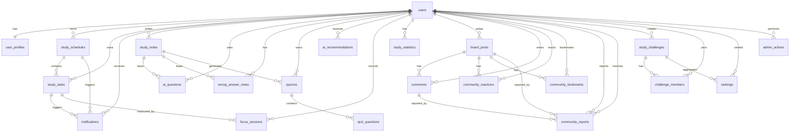

# 2단계 구현 계획 문서

문서 연결:
- 상위 문서: [설계 문서](./design-document.md)
- 관련 문서:
  - [요구사항 문서](../requirements/requirements-document.md)
  - [아키텍처 개요](./architecture-overview.md)
  - [커뮤니티 게시판 기존 구현 분석 및 이식 계획](./community-board-reuse-plan.md)

---

## 문서 목적

본 문서는 GitHub Issue #13 “[Phase 2] API 목록 및 ERD 초안 작성”을 진행하기 위한 2단계 구현 준비 문서이다.

1단계 산출물인 `docs/requirements/requirements-document.md`와 `docs/design/design-document.md`를 기준으로 2단계 구현 전에 필요한 API 목록, DB 테이블 초안, ERD 관계, Prisma schema 작성 방향, 구현 우선순위, 테스트 전략을 정리한다.

본 문서는 실제 구현 코드가 아니라 구현 전 설계 기준 문서이며, 이후 `src/frontend/`, `src/backend/` 초기 프로젝트 세팅과 기능별 구현 Issue 분리에 활용한다.

---

## 목차

1. [확정 기술 스택](#1-확정-기술-스택)
2. [MVP 구현 범위](#2-mvp-구현-범위)
3. [API 목록 초안](#3-api-목록-초안)
4. [DB 테이블 초안](#4-db-테이블-초안)
5. [ERD 관계 초안](#5-erd-관계-초안)
6. [Mermaid ERD 코드](#6-mermaid-erd-코드)
7. [Prisma schema 작성 방향](#7-prisma-schema-작성-방향)
8. [구현 우선순위](#8-구현-우선순위)
9. [테스트 전략](#9-테스트-전략)
10. [초기 프로젝트 세팅 전 확인 사항](#10-초기-프로젝트-세팅-전-확인-사항)
11. [문서 요약](#11-문서-요약)

---

## 1. 확정 기술 스택

| 구분 | 확정 기술 | 적용 목적 |
|---|---|---|
| Frontend | React Native + Expo | Web/Mobile 기반 학습 관리 앱 화면 구현 |
| Backend | Node.js + Express | REST API 서버 및 비즈니스 로직 구현 |
| DBMS | PostgreSQL | 사용자, 일정, 학습 기록, 커뮤니티 등 관계형 데이터 저장 |
| ORM | Prisma | DB schema 관리, migration, type-safe query 작성 |
| Auth | JWT + bcrypt | 로그인 인증, 비밀번호 암호화, 관리자 권한 확인 |
| API 방식 | REST API | 클라이언트-서버 간 표준 HTTP 통신 |
| Test | Jest + Supertest | 유닛 테스트, API 통합 테스트, 테스트 보고서 근거 확보 |
| Frontend Deployment | Vercel | Expo Web 클라이언트 배포 |
| Backend Deployment | Render | Node.js + Express REST API 서버 배포 |
| DB Hosting | Neon | PostgreSQL 데이터베이스 클라우드 호스팅 |

PostgreSQL을 단일 DBMS로 사용한다.

- AI 응답 결과나 퀴즈 선택지처럼 구조가 유동적인 데이터는 Prisma의 `Json` 타입을 우선 활용한다.
- MongoDB나 복수 DB 구성은 2단계 MVP 범위에서는 제외하고, 최종 보고서의 확장 가능성으로 남긴다.
- Neon은 DBMS가 아니라 PostgreSQL을 클라우드에서 제공하는 DB 호스팅 서비스로 사용한다.

---

## 2. MVP 구현 범위

2단계 구현은 과제 요구사항과 구현 가능성을 고려하여 MVP 기능과 확장 기능을 분리한다.

### 2.1 MVP 필수 구현

| 우선순위 | 기능 | 관련 요구사항 | 관련 유스케이스 |
|---|---|---|---|
| 1 | 회원가입/로그인 | FR-01, NFR-02, NFR-03 | UC-01, UC-02 |
| 2 | 사용자 프로필 관리 | FR-02 | - |
| 3 | 학습 일정 관리 | FR-03, FR-05, FR-22 | UC-03 |
| 4 | 칸반 보드 관리 | FR-04 | UC-04 |
| 5 | 학습 노트 관리 | FR-06 | - |
| 6 | AI 학습 질의 및 AI 기반 퀴즈 생성 | FR-07, FR-10 | UC-05, UC-19 |
| 7 | 집중 시간 기록 및 학습 통계 | FR-15, FR-16, FR-17 | UC-11, UC-12 |
| 8 | 게시판 기본 기능 | FR-13 | UC-10 |
| 9 | 관리자 기본 기능 | FR-27, FR-28 | UC-18, UC-20 |

### 2.2 MVP 이후 확장 기능

| 기능 | 관련 요구사항 | 확장 사유 |
|---|---|---|
| AI 오답노트 | FR-08 | AI 결과 품질과 데이터 구조 검증 필요 |
| AI 학습 추천 | FR-09 | 통계/오답 데이터 누적 이후 효과적 |
| 스터디 챌린지 및 랭킹 | FR-11, FR-12, FR-29 | 그룹/순위 계산 로직 필요 |
| TTS/STT | FR-18, FR-21 | 외부 API 또는 기기 권한 연동 필요 |
| 앱 차단 모드 | FR-14 | 모바일 OS 권한 및 플랫폼 제약 큼 |
| 퀘스트/뱃지/포인트 | FR-24 | 보상 정책 상세 설계 필요 |
| 사용자 유형별 동적 UI | FR-23, FR-25 | 프론트엔드 UI 설계 범위 증가 |

---

## 3. API 목록 초안

API는 REST 방식으로 작성하며, 인증이 필요한 API는 JWT 인증 미들웨어를 적용한다. 관리자 기능은 `role = ADMIN` 권한 확인을 추가한다.

### 3.1 Auth/User API

| Method | Endpoint | 설명 | 관련 요구사항 | 관련 UC |
|---|---|---|---|---|
| POST | `/api/auth/register` | 회원가입 | FR-01 | UC-01 |
| POST | `/api/auth/login` | 로그인 및 JWT 발급 | FR-01 | UC-02 |
| POST | `/api/auth/logout` | 로그아웃 처리 | FR-01 | UC-02 |
| GET | `/api/auth/me` | 현재 로그인 사용자 조회 | FR-01, FR-02 | UC-02 |
| PATCH | `/api/users/me/profile` | 사용자 프로필 수정 | FR-02, FR-23 | - |
| GET | `/api/admin/users` | 관리자 사용자 목록 조회 | FR-28 | UC-20 |
| PATCH | `/api/admin/users/:userId/suspend` | 사용자 계정 제재 | FR-28 | UC-20 |

### 3.2 Schedule/Task API

| Method | Endpoint | 설명 | 관련 요구사항 | 관련 UC |
|---|---|---|---|---|
| GET | `/api/schedules` | 학습 일정 목록 조회 | FR-03 | UC-03 |
| POST | `/api/schedules` | 학습 일정 생성 | FR-03 | UC-03 |
| GET | `/api/schedules/:scheduleId` | 학습 일정 상세 조회 | FR-03 | UC-03 |
| PATCH | `/api/schedules/:scheduleId` | 학습 일정 수정 | FR-03 | UC-03 |
| DELETE | `/api/schedules/:scheduleId` | 학습 일정 삭제 | FR-03 | UC-03 |
| POST | `/api/schedules/:scheduleId/sync-calendar` | 외부 캘린더 연동 요청 | FR-22, NFR-07 | UC-03 |
| GET | `/api/tasks` | 칸반 태스크 목록 조회 | FR-04 | UC-04 |
| POST | `/api/tasks` | 칸반 태스크 생성 | FR-04 | UC-04 |
| PATCH | `/api/tasks/:taskId` | 칸반 태스크 수정 | FR-04 | UC-04 |
| PATCH | `/api/tasks/:taskId/status` | 태스크 상태 변경 | FR-04 | UC-04 |
| DELETE | `/api/tasks/:taskId` | 칸반 태스크 삭제 | FR-04 | UC-04 |
| GET | `/api/notifications` | 알림 목록 조회 | FR-05, FR-26 | UC-17 |

### 3.3 Notes/AI API

| Method | Endpoint | 설명 | 관련 요구사항 | 관련 UC |
|---|---|---|---|---|
| GET | `/api/notes` | 학습 노트 목록 조회 | FR-06 | - |
| POST | `/api/notes` | 학습 노트 작성 | FR-06 | - |
| GET | `/api/notes/:noteId` | 학습 노트 상세 조회 | FR-06 | - |
| PATCH | `/api/notes/:noteId` | 학습 노트 수정 | FR-06 | - |
| DELETE | `/api/notes/:noteId` | 학습 노트 삭제 | FR-06 | - |
| POST | `/api/ai/questions` | AI 학습 질의 | FR-07 | UC-05 |
| POST | `/api/ai/wrong-answer-notes` | AI 오답노트 생성 | FR-08 | UC-06 |
| POST | `/api/ai/recommendations` | AI 학습 추천 생성 | FR-09 | UC-07 |
| POST | `/api/ai/quizzes` | AI 기반 퀴즈 생성 | FR-10 | UC-19 |
| POST | `/api/ai/summaries` | 학습 내용 요약 | FR-19 | UC-13 |

### 3.4 Statistics/Focus API

집중 시간 측정은 클라이언트에서 타이머를 실행하고, 학습 종료 시점에 최종 누적 시간만 서버로 전송하는 방식으로 설계한다. 서버는 진행 중인 타이머 상태를 관리하지 않고, 완료된 집중 세션 기록만 저장한다. 집중 시간은 `durationMs` 단위로 저장하고, 화면 표시나 통계 계산 시 분/시간 단위로 변환한다.

| Method | Endpoint | 설명 | 관련 요구사항 | 관련 UC |
|---|---|---|---|---|
| POST | `/api/focus-sessions` | 클라이언트에서 측정한 최종 집중 시간 저장 | FR-15 | UC-12 |
| GET | `/api/focus-sessions` | 집중 세션 기록 조회 | FR-15 | UC-12 |
| GET | `/api/statistics` | 학습 통계 조회 | FR-16 | UC-11 |
| GET | `/api/statistics/heatmap` | 학습 히트맵 조회 | FR-17 | UC-11 |

`POST /api/focus-sessions` 요청 데이터 예시는 다음과 같다.

```json
{
  "taskId": 1,
  "startedAt": "2026-05-16T20:00:00.000Z",
  "endedAt": "2026-05-16T20:45:00.000Z",
  "durationMs": 2700000,
  "memo": "운영체제 복습"
}
```

`durationMs`는 클라이언트에서 계산한 최종 누적 시간이다. 분 단위 저장 필드는 사용하지 않으며, 화면 표시나 통계 계산 시에만 `durationMs`를 분/시간 단위로 변환한다.

### 3.5 Community/Admin API

| Method | Endpoint | 설명 | 관련 요구사항 | 관련 UC |
|---|---|---|---|---|
| GET | `/api/community/posts` | 게시글 목록 조회 | FR-13 | UC-10 |
| POST | `/api/community/posts` | 게시글 작성 | FR-13 | UC-10 |
| GET | `/api/community/posts/:postId` | 게시글 상세 조회 | FR-13 | UC-10 |
| PATCH | `/api/community/posts/:postId` | 게시글 수정 | FR-13 | UC-10 |
| DELETE | `/api/community/posts/:postId` | 게시글 삭제 | FR-13 | UC-10 |
| POST | `/api/community/posts/:postId/comments` | 댓글 작성(후속) | FR-13 | UC-10 |
| POST | `/api/community/posts/:postId/reactions` | 게시글 좋아요/싫어요 반응(후속) | FR-13 | UC-10 |
| POST | `/api/community/posts/:postId/bookmarks` | 게시글 북마크(후속) | FR-13 | UC-10 |
| POST | `/api/community/posts/:postId/reports` | 게시글 신고(후속 후보) | FR-27 | UC-18 |
| GET | `/api/rankings/weekly` | 주간 학습 랭킹 조회 | FR-11 | UC-08 |
| GET | `/api/challenges` | 스터디 챌린지 목록 조회 | FR-12 | UC-09 |
| POST | `/api/challenges` | 스터디 챌린지 생성 | FR-12 | UC-09 |
| POST | `/api/challenges/:challengeId/join` | 스터디 챌린지 참여 | FR-12 | UC-09 |
| PATCH | `/api/admin/posts/:postId/moderation` | 관리자 게시판 관리 | FR-27 | UC-18 |
| PATCH | `/api/admin/challenges/:challengeId/moderation` | 관리자 챌린지 관리 | FR-29 | UC-21 |

커뮤니티 사용자용 API namespace는 `/api/community` 기준으로 정리한다. 게시글/댓글 기본 API와 게시글 목록 검색·정렬·페이징은 구현되었고, 좋아요/싫어요 반응과 북마크는 `CommunityReaction`, `CommunityBookmark` schema/migration을 먼저 준비한 뒤 API를 후속 작업으로 분리한다. 신고 기능은 `CommunityReport`, 신고 상태 enum, 신고 대상 enum schema/migration을 선행하고 사용자 신고 API와 관리자 처리 API를 후속 작업으로 분리한다.

---

## 4. DB 테이블 초안

### 4.1 사용자/인증 영역

| 테이블 | 설명 | 주요 필드 |
|---|---|---|
| `users` | 사용자 계정 및 권한 정보 | `id`, `login_id`, `password_hash`, `name`, `role`, `user_type`, `status`, `created_at`, `updated_at` |
| `user_profiles` | 사용자 프로필 및 학습 목표 | `id`, `user_id`, `learning_goal`, `preferred_subject`, `profile_image_url`, `created_at`, `updated_at` |

### 4.2 일정/태스크/알림 영역

| 테이블 | 설명 | 주요 필드 |
|---|---|---|
| `study_schedules` | 학습 일정 | `id`, `user_id`, `title`, `subject`, `start_at`, `end_at`, `priority`, `memo`, `created_at`, `updated_at` |
| `study_tasks` | 칸반 태스크 | `id`, `user_id`, `schedule_id`, `title`, `status`, `due_date`, `priority`, `memo`, `created_at`, `updated_at` |
| `notifications` | 마감일/복습/챌린지 알림 | `id`, `user_id`, `schedule_id`, `task_id`, `type`, `message`, `scheduled_at`, `read_at`, `created_at` |

### 4.3 노트/AI 학습 영역

| 테이블 | 설명 | 주요 필드 |
|---|---|---|
| `study_notes` | 학습 노트 | `id`, `user_id`, `title`, `content`, `subject`, `tags`, `created_at`, `updated_at` |
| `ai_questions` | AI 학습 질의 기록 | `id`, `user_id`, `note_id`, `question`, `answer`, `subject`, `created_at` |
| `wrong_answer_notes` | AI 오답노트 | `id`, `user_id`, `note_id`, `problem`, `user_answer`, `explanation`, `weak_type`, `created_at` |
| `quizzes` | AI 기반 퀴즈 세트 | `id`, `user_id`, `note_id`, `title`, `difficulty`, `created_at` |
| `quiz_questions` | 퀴즈 문항 | `id`, `quiz_id`, `question`, `choices_json`, `answer`, `explanation`, `order_no` |
| `ai_recommendations` | AI 학습 추천 결과 | `id`, `user_id`, `basis_json`, `recommendation_json`, `created_at` |

### 4.4 집중/통계 영역

| 테이블 | 설명 | 주요 필드 |
|---|---|---|
| `focus_sessions` | 클라이언트에서 측정 완료된 집중 시간 기록 | `id`, `user_id`, `task_id`, `started_at`, `ended_at`, `duration_ms`, `memo`, `created_at` |
| `study_statistics` | 학습 통계 스냅샷 | `id`, `user_id`, `period_start`, `period_end`, `total_minutes`, `completion_rate`, `statistics_json`, `created_at` |

`focus_sessions.duration_ms`는 클라이언트에서 계산된 최종 누적 시간이다. `started_at`, `ended_at`은 클라이언트가 전달하는 실제 측정 시작/종료 시각이며, 서버는 진행 중인 세션 상태를 관리하지 않고 완료된 기록만 저장한다.

### 4.5 커뮤니티/관리자 영역

| 테이블 | 설명 | 주요 필드 |
|---|---|---|
| `board_posts` | 게시판 게시글 | `id`, `user_id`, `category`, `title`, `content`, `reported`, `created_at`, `updated_at` |
| `comments` | 게시글 댓글 | `id`, `post_id`, `user_id`, `content`, `reported`, `created_at`, `updated_at` |
| `community_reactions` | 게시글 좋아요/싫어요 통합 반응 | `id`, `post_id`, `user_id`, `type`, `created_at`, `updated_at` |
| `community_bookmarks` | 게시글 북마크 | `id`, `post_id`, `user_id`, `created_at` |
| `community_reports` | 게시글/댓글 신고 이력 | `id`, `reporter_id`, `target_type`, `post_id`, `comment_id`, `reason`, `status`, `resolved_by_id`, `resolved_at`, `resolution_note`, `created_at`, `updated_at` |
| `study_challenges` | 스터디 챌린지 | `id`, `creator_id`, `title`, `description`, `goal_minutes`, `start_date`, `end_date`, `status`, `created_at` |
| `challenge_members` | 챌린지 참여자 및 진행도 | `id`, `challenge_id`, `user_id`, `progress_minutes`, `joined_at` |
| `rankings` | 주간 랭킹 집계 결과 | `id`, `user_id`, `challenge_id`, `period_start`, `period_end`, `rank`, `study_minutes`, `created_at` |
| `admin_actions` | 관리자 제재 및 운영 처리 기록 | `id`, `admin_id`, `target_type`, `target_id`, `action_type`, `reason`, `created_at` |

---

## 5. ERD 관계 초안

| 관계 | 유형 | 설명 |
|---|---|---|
| `users` - `user_profiles` | 1:1 | 사용자 한 명은 하나의 프로필을 가진다. |
| `users` - `study_schedules` | 1:N | 사용자 한 명은 여러 학습 일정을 등록할 수 있다. |
| `users` - `study_tasks` | 1:N | 사용자 한 명은 여러 칸반 태스크를 가진다. |
| `study_schedules` - `study_tasks` | 1:N | 하나의 일정은 여러 태스크와 연결될 수 있다. |
| `users` - `notifications` | 1:N | 사용자별 알림을 저장한다. |
| `study_schedules` - `notifications` | 1:N | 일정 마감 알림과 연결된다. |
| `study_tasks` - `notifications` | 1:N | 태스크 마감 알림과 연결된다. |
| `users` - `study_notes` | 1:N | 사용자 한 명은 여러 학습 노트를 작성할 수 있다. |
| `study_notes` - `ai_questions` | 1:N | 노트 기반 AI 질의 기록을 저장한다. |
| `study_notes` - `wrong_answer_notes` | 1:N | 노트 또는 문제 기반 오답노트를 저장한다. |
| `study_notes` - `quizzes` | 1:N | 노트 기반 복습 퀴즈를 생성한다. |
| `quizzes` - `quiz_questions` | 1:N | 퀴즈 세트 하나는 여러 문항을 가진다. |
| `users` - `ai_recommendations` | 1:N | 사용자별 AI 추천 결과를 저장한다. |
| `users` - `focus_sessions` | 1:N | 사용자별 집중 세션 기록을 저장한다. |
| `study_tasks` - `focus_sessions` | 1:N | 집중 세션은 특정 태스크와 연결될 수 있다. |
| `users` - `study_statistics` | 1:N | 기간별 학습 통계 스냅샷을 저장한다. |
| `users` - `board_posts` | 1:N | 사용자 한 명은 여러 게시글을 작성할 수 있다. |
| `board_posts` - `comments` | 1:N | 게시글 하나는 여러 댓글을 가진다. |
| `users` - `comments` | 1:N | 사용자 한 명은 여러 댓글을 작성할 수 있다. |
| `board_posts` - `community_reactions` | 1:N | 게시글 하나는 여러 사용자 반응을 가진다. 게시글 삭제 시 반응은 함께 정리한다. |
| `users` - `community_reactions` | 1:N | 사용자 한 명은 여러 게시글 반응을 남길 수 있다. |
| `board_posts` - `community_bookmarks` | 1:N | 게시글 하나는 여러 북마크를 가질 수 있다. 게시글 삭제 시 북마크는 함께 정리한다. |
| `users` - `community_bookmarks` | 1:N | 사용자 한 명은 여러 게시글을 북마크할 수 있다. |
| `users` - `community_reports` | 1:N | 사용자 한 명은 여러 게시글/댓글 신고를 남길 수 있다. |
| `users` - `community_reports` | 1:N | 관리자 사용자는 여러 신고 처리자로 기록될 수 있다. |
| `board_posts` - `community_reports` | 1:N | 게시글 하나는 여러 신고 이력을 가질 수 있다. 게시글 삭제 시 해당 신고 이력도 함께 정리한다. |
| `comments` - `community_reports` | 1:N | 댓글 하나는 여러 신고 이력을 가질 수 있다. 댓글 삭제 시 해당 신고 이력도 함께 정리한다. |
| `users` - `study_challenges` | 1:N | 사용자는 챌린지를 생성할 수 있다. |
| `users` - `study_challenges` | N:M | 사용자는 여러 챌린지에 참여할 수 있고, 챌린지는 여러 사용자를 가진다. `challenge_members`로 연결한다. |
| `study_challenges` - `rankings` | 1:N | 챌린지별 랭킹 결과를 저장할 수 있다. |
| `users` - `admin_actions` | 1:N | 관리자는 여러 운영 처리 기록을 남길 수 있다. |

---

## 6. Mermaid ERD 코드



---

## 7. Prisma schema 작성 방향

Prisma schema는 PostgreSQL 기준으로 작성한다. 테이블명은 snake_case를 사용하고, Prisma 모델명은 PascalCase를 사용한다.

### 7.1 공통 작성 규칙

- 모든 주요 테이블은 `id`, `createdAt`, `updatedAt`을 기본으로 둔다.
- DB 컬럼명은 `@map` 또는 `@@map`을 사용해 snake_case로 매핑한다.
- 비밀번호는 `passwordHash`로 저장하고 평문 비밀번호는 저장하지 않는다. (`NFR-02`)
- AI 응답, 추천 근거, 퀴즈 선택지 등 유동적인 데이터는 `Json` 타입을 사용한다.
- 사용자 권한, 계정 상태, 태스크 상태, 챌린지 상태 등은 enum으로 정의한다.
- 외래키 삭제 정책은 데이터 손실 위험을 고려하여 기본적으로 `Restrict` 또는 `SetNull`을 우선 검토한다.
- `FocusSession`은 클라이언트에서 측정한 최종 집중 시간을 `durationMs`로 저장한다. DB 컬럼은 `duration_ms`로 매핑하며, 화면 표시와 통계 계산에서는 해당 값을 분/시간 단위로 변환하여 사용한다.

### 7.2 주요 enum 후보

| enum | 값 후보 |
|---|---|
| `Role` | `USER`, `ADMIN` |
| `UserType` | `ELEMENTARY`, `MIDDLE`, `HIGH`, `UNIVERSITY`, `EXAM_PREP`, `WORKER`, `SENIOR` |
| `AccountStatus` | `ACTIVE`, `SUSPENDED`, `DEACTIVATED` |
| `TaskStatus` | `TODO`, `IN_PROGRESS`, `DONE` |
| `Priority` | `LOW`, `MEDIUM`, `HIGH` |
| `NotificationType` | `DEADLINE`, `REVIEW`, `CHALLENGE` |
| `PostCategory` | `QUESTION`, `FREE`, `STUDY_PROOF` |
| `ChallengeStatus` | `IN_PROGRESS`, `CLOSED` |
| `Difficulty` | `EASY`, `MEDIUM`, `HARD` |
| `AdminActionType` | `SUSPEND_USER`, `HIDE_POST`, `DELETE_COMMENT`, `MODERATE_CHALLENGE` |

### 7.3 Prisma 모델 작성 우선순위

1. `User`, `UserProfile`
2. `StudySchedule`, `StudyTask`, `Notification`
3. `StudyNote`, `AIQuestion`, `Quiz`, `QuizQuestion`
4. `FocusSession`, `StudyStatistics`
5. `BoardPost`, `Comment`
6. `StudyChallenge`, `ChallengeMember`, `Ranking`
7. `WrongAnswerNote`, `AIRecommendation`, `AdminAction`

---

## 8. 구현 우선순위

| 단계 | 구현 범위 | 관련 API/테이블 | 완료 기준 |
|---|---|---|---|
| 1 | 백엔드 기본 세팅 | Express, Prisma, PostgreSQL, health check | 서버 실행 및 DB 연결 성공 |
| 2 | 인증/사용자 | Auth/User API, `users`, `user_profiles` | 회원가입/로그인/JWT 테스트 통과 |
| 3 | 일정/태스크 | Schedule/Task API, `study_schedules`, `study_tasks`, `notifications` | 일정/태스크 CRUD 테스트 통과 |
| 4 | 노트/AI MVP | Notes/AI API, `study_notes`, `ai_questions`, `quizzes`, `quiz_questions` | 노트 CRUD, AI Mock 응답 저장 테스트 통과 |
| 5 | 집중/통계 | Statistics/Focus API, `focus_sessions`, `study_statistics` | 클라이언트 측 타이머 종료 후 완료된 집중 기록 저장 및 통계 조회 테스트 통과 |
| 6 | 커뮤니티 | Community API, `board_posts`, `comments`, `community_reactions`, `community_bookmarks`, `community_reports` | 게시글/댓글/반응/북마크 API 테스트 통과, 신고는 schema 선행 후 사용자 신고 API와 관리자 처리 API 후속 구현 |
| 7 | 관리자 | Admin API, `admin_actions` | 게시글 처리, 사용자 제재 테스트 통과 |
| 8 | 확장 기능 | 챌린지, 랭킹, 오답노트, 추천 | MVP 완료 후 선택 구현 |

---

## 9. 테스트 전략

2단계 테스트 보고서 요구사항을 고려하여 기능 구현과 동시에 테스트 증빙을 누적한다.

### 9.1 테스트 도구

| 테스트 유형 | 도구 | 대상 |
|---|---|---|
| Unit Test | Jest | service 함수, validation, 통계 계산 |
| Integration Test | Jest + Supertest | Express API 요청/응답, 인증, DB 연동 |
| AI Mock Test | Jest Mock | AI 질의, 퀴즈 생성, 추천 API |
| Manual Test | 체크리스트 | 프론트엔드 주요 화면 흐름 |

### 9.2 테스트 케이스 우선순위

| 우선순위 | 테스트 대상 | 검증 내용 |
|---|---|---|
| 1 | 인증 | 회원가입, 로그인, JWT 인증 실패, 비밀번호 암호화 |
| 2 | 일정/태스크 | 일정 CRUD, 태스크 상태 변경, 사용자별 데이터 격리 |
| 3 | 노트/AI | 노트 CRUD, AI Mock 응답 저장, 퀴즈 문항 생성 |
| 4 | 통계 | 집중 시간 저장, 기간별 총 학습 시간 계산 |
| 5 | 커뮤니티 | 1차 게시글 CRUD, 후속 댓글/신고 처리 |
| 6 | 관리자 | 관리자 권한 확인, 사용자 제재, 게시글 관리 |

### 9.3 테스트 보고서 기록 항목

- 유닛 테스트 케이스 목록
- 통합 테스트 케이스 목록
- 테스트 실행 결과
- 커버리지 결과
- 버그 로그
- AI로 생성하거나 보조받은 테스트 스크립트
- 미구현/확장 예정 기능의 테스트 계획

---

## 10. 초기 프로젝트 세팅 전 확인 사항

초기 프로젝트 세팅은 별도 브랜치에서 진행하며, 본 문서 작성 브랜치에서는 실제 구현 코드를 생성하지 않는다.

### 10.1 세팅 전 결정 사항

- PostgreSQL 사용 방식: 로컬 설치 또는 Docker 사용 여부
- `.env` 변수 목록: `DATABASE_URL`, `JWT_SECRET`, AI API 관련 키
- 프론트엔드 실행 방식: Expo Go, Web preview, Android emulator 중 우선 방식
- 백엔드 포트와 CORS 허용 범위
- Prisma migration 관리 방식
- 테스트 DB 사용 방식

### 10.2 추천 초기 세팅 브랜치

| 작업 | 브랜치 |
|---|---|
| 초기 프로젝트 세팅 | `chore/project-bootstrap` |
| 백엔드 인증 구현 | `feat/backend-auth` |
| 프론트엔드 인증 화면 | `feat/frontend-auth` |
| 일정/태스크 구현 | `feat/schedule-task` |
| 노트/AI MVP 구현 | `feat/notes-ai` |
| 테스트 보고서 작성 | `test/test-report` |

### 10.3 구현 전 확인 체크리스트

- [ ] `main` 최신화
- [ ] 초기 세팅 브랜치 생성
- [ ] PostgreSQL 실행 방식 결정
- [ ] Prisma schema 초안 확정
- [ ] API 목록을 기능별 Issue로 분리
- [ ] MVP 기능 범위 팀 합의
- [ ] 테스트 보고서 작성 위치와 형식 합의

---

## 11. 문서 요약

본 문서는 2단계 구현 전 API 목록과 ERD 초안을 정리한 문서이다. MVP는 인증, 일정/태스크, 노트/AI 일부 기능, 집중/통계, 게시판, 관리자 기본 기능을 중심으로 구성한다.

구현 단계에서는 PostgreSQL, Prisma, Express, React Native + Expo를 기준으로 프로젝트를 초기화하고, 기능별 브랜치와 PR을 통해 단계적으로 구현한다. 테스트는 Jest와 Supertest를 사용하여 API 중심으로 먼저 구축하고, 결과는 `docs/test-report/`에 누적한다.

---

## 관련 산출물

- [문서 부록 인덱스](../README.md)
- [최종보고서](../final-report/final-report-draft.md)
- [요구사항 문서](../requirements/requirements-document.md)
- [API 명세](../api/api-spec.md)
- [테스트 보고서](../test-report/test-report.md)
- [구현 계획](./implementation-plan.md)
