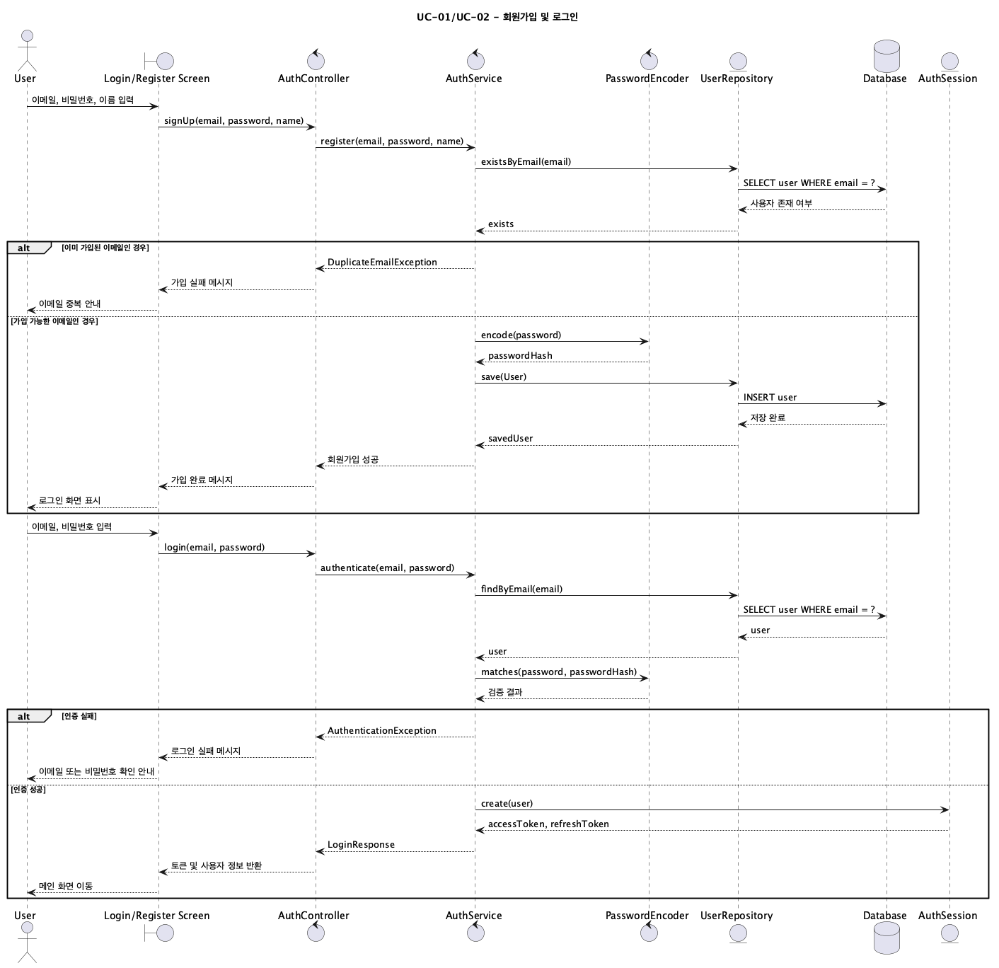
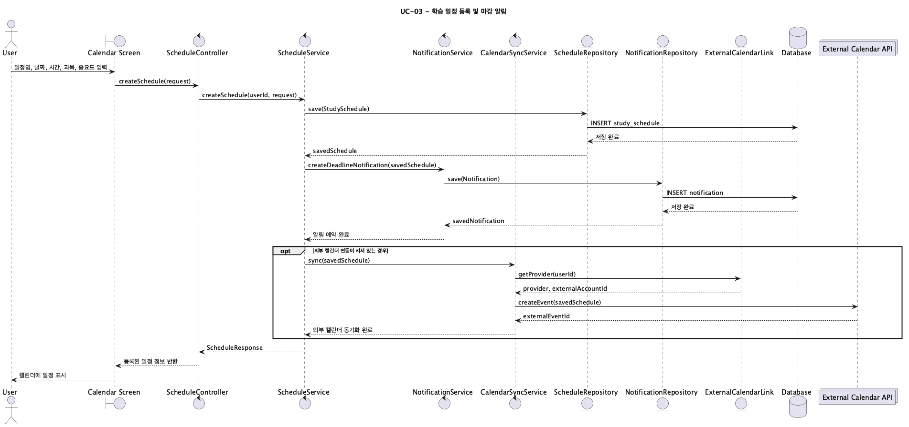
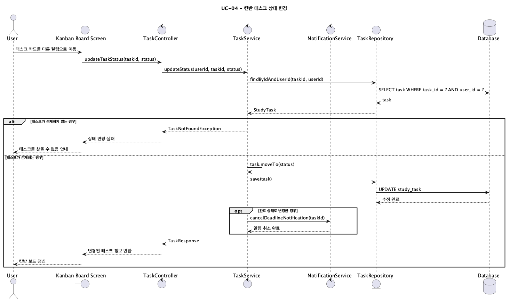
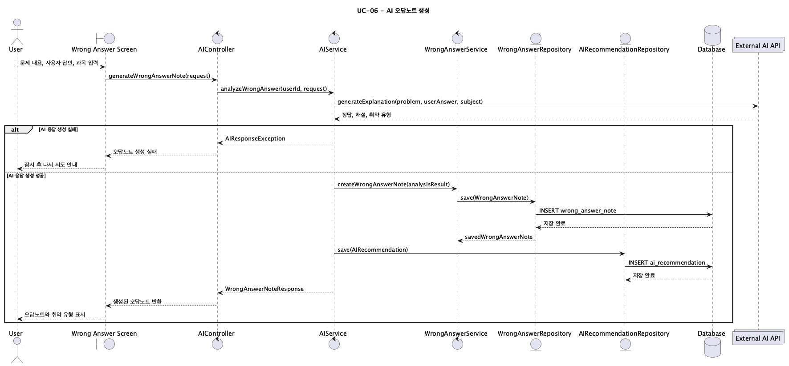
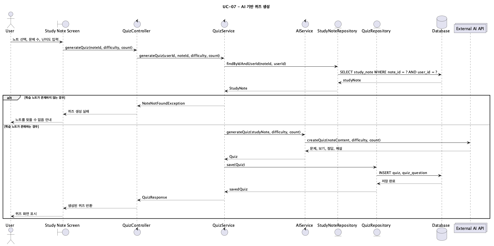
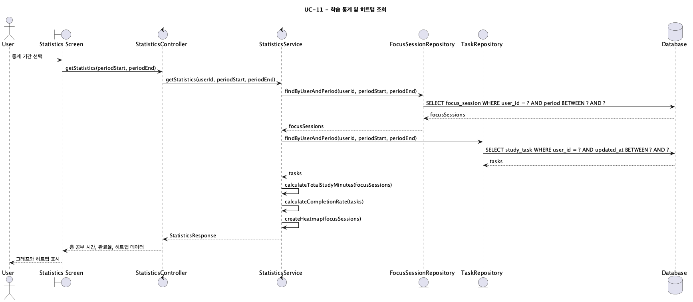
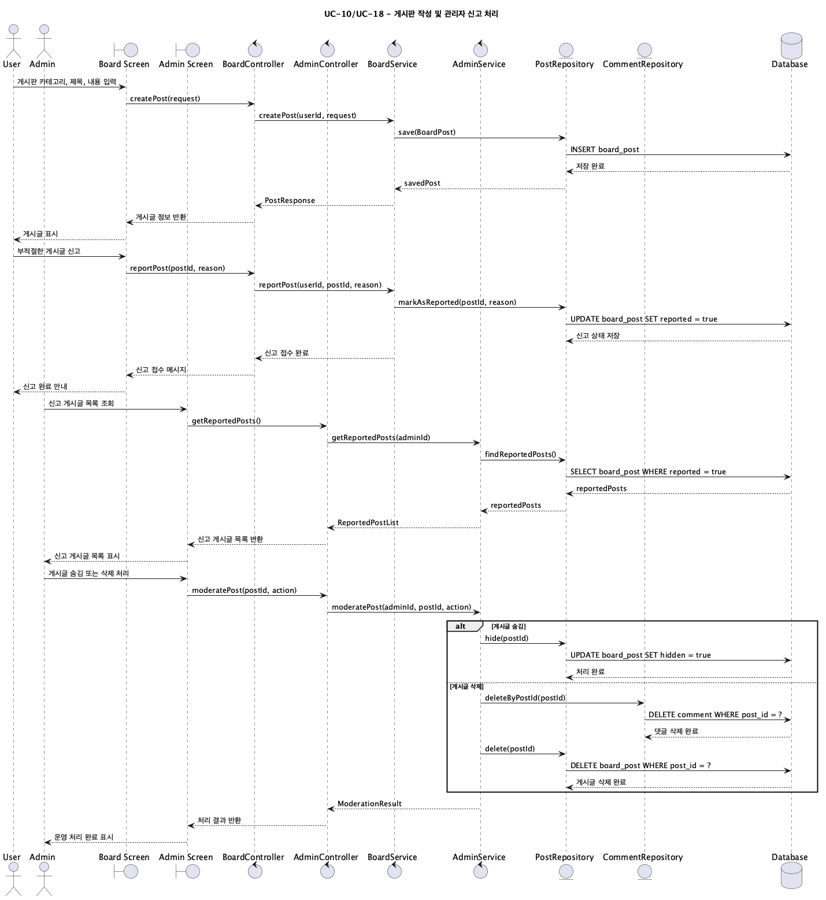

# Smart Edu Platform 시퀀스 다이어그램

---

## 1. 문서 개요

본 문서는 Smart Edu Platform의 주요 유스케이스가 어떤 순서로 처리되는지 UML 시퀀스 다이어그램으로 정의한 설계 문서이다.

요구사항 문서의 유스케이스 흐름과 기능 요구사항을 기준으로, 사용자가 실제 시스템을 사용할 때의 대표 프로세스를 PlantUML로 작성하였다.

---

## 2. 시퀀스 다이어그램 작성 기준

본 문서의 시퀀스 다이어그램은 다음 설계 기준을 따른다.

- 액터, 화면, 컨트롤러, 서비스, 저장소, 데이터베이스, 외부 시스템의 역할을 구분한다.
- 정상 흐름을 중심으로 작성하되, 중요한 예외 흐름은 `alt` 블록으로 표시한다.
- 각 시퀀스는 요구사항 ID와 유스케이스 ID를 함께 표시한다.
- 다이어그램 구현 코드는 [plantuml/sequence-diagrams.puml](plantuml/sequence-diagrams.puml)에 보관한다.
- 렌더링 이미지는 [sequence-diagram/](sequence-diagram/) 폴더에 보관한다.

---

## 3. UC-01 회원가입 및 로그인

### 3.1 관련 요구사항

| 항목 | 내용 |
|---|---|
| 유스케이스 | `UC-01`, `UC-02` |
| 기능 요구사항 | `FR-01`, `FR-02` |
| 비기능 요구사항 | `NFR-02`, `NFR-03` |
| 주요 액터 | 일반 사용자 |

### 3.2 시퀀스 다이어그램

다이어그램 구현 코드는 [plantuml/sequence-diagrams.puml](plantuml/sequence-diagrams.puml)에 통합 보관한다.

---

## 4. UC-03 학습 일정 등록 및 마감 알림

### 4.1 관련 요구사항

| 항목 | 내용 |
|---|---|
| 유스케이스 | `UC-03` |
| 기능 요구사항 | `FR-03`, `FR-05`, `FR-22` |
| 비기능 요구사항 | `NFR-01`, `NFR-12` |
| 주요 액터 | 일반 사용자 |

### 4.2 시퀀스 다이어그램

다이어그램 구현 코드는 [plantuml/sequence-diagrams.puml](plantuml/sequence-diagrams.puml)에 통합 보관한다.

---

## 5. UC-04 칸반 태스크 상태 변경

### 5.1 관련 요구사항

| 항목 | 내용 |
|---|---|
| 유스케이스 | `UC-04` |
| 기능 요구사항 | `FR-04`, `FR-05` |
| 비기능 요구사항 | `NFR-01`, `NFR-10` |
| 주요 액터 | 일반 사용자 |

### 5.2 시퀀스 다이어그램

다이어그램 구현 코드는 [plantuml/sequence-diagrams.puml](plantuml/sequence-diagrams.puml)에 통합 보관한다.

---

## 6. UC-06 AI 오답노트 생성

### 6.1 관련 요구사항

| 항목 | 내용 |
|---|---|
| 유스케이스 | `UC-06` |
| 기능 요구사항 | `FR-07`, `FR-08`, `FR-09` |
| 비기능 요구사항 | `NFR-01`, `NFR-03`, `NFR-12` |
| 주요 액터 | 일반 사용자 |

### 6.2 시퀀스 다이어그램

다이어그램 구현 코드는 [plantuml/sequence-diagrams.puml](plantuml/sequence-diagrams.puml)에 통합 보관한다.

---

## 7. UC-07 AI 기반 퀴즈 생성

### 7.1 관련 요구사항

| 항목 | 내용 |
|---|---|
| 유스케이스 | `UC-07` |
| 기능 요구사항 | `FR-10` |
| 비기능 요구사항 | `NFR-01`, `NFR-03`, `NFR-12` |
| 주요 액터 | 일반 사용자 |

### 7.2 시퀀스 다이어그램

다이어그램 구현 코드는 [plantuml/sequence-diagrams.puml](plantuml/sequence-diagrams.puml)에 통합 보관한다.

---

## 8. UC-11 학습 통계 및 히트맵 조회

### 8.1 관련 요구사항

| 항목 | 내용 |
|---|---|
| 유스케이스 | `UC-11` |
| 기능 요구사항 | `FR-16`, `FR-17` |
| 비기능 요구사항 | `NFR-01`, `NFR-11` |
| 주요 액터 | 일반 사용자 |

### 8.2 시퀀스 다이어그램

다이어그램 구현 코드는 [plantuml/sequence-diagrams.puml](plantuml/sequence-diagrams.puml)에 통합 보관한다.

---

## 9. UC-10 게시판 작성 및 관리자 신고 처리

### 9.1 관련 요구사항

| 항목 | 내용 |
|---|---|
| 유스케이스 | `UC-10`, `UC-18` |
| 기능 요구사항 | `FR-13`, `FR-27` |
| 비기능 요구사항 | `NFR-01`, `NFR-10`, `NFR-13` |
| 주요 액터 | 일반 사용자, 관리자 |

### 9.2 시퀀스 다이어그램

다이어그램 구현 코드는 [plantuml/sequence-diagrams.puml](plantuml/sequence-diagrams.puml)에 통합 보관한다.

---

## 10. 시퀀스 다이어그램 요약

| 다이어그램 | 주요 흐름 | 이미지 | 구현 코드 |
|---|---|---|---|
| `UC-01`, `UC-02` | 회원가입, 로그인, 인증 실패 처리 | [UC01_Login.png](sequence-diagram/UC01_Login.png) | [sequence-diagrams.puml](plantuml/sequence-diagrams.puml) |
| `UC-03` | 학습 일정 등록, 마감 알림, 외부 캘린더 연동 | [UC03_CreateSchedule.png](sequence-diagram/UC03_CreateSchedule.png) | [sequence-diagrams.puml](plantuml/sequence-diagrams.puml) |
| `UC-04` | 칸반 태스크 상태 변경, 완료 시 알림 취소 | [UC04_UpdateTaskStatus.png](sequence-diagram/UC04_UpdateTaskStatus.png) | [sequence-diagrams.puml](plantuml/sequence-diagrams.puml) |
| `UC-06` | AI 오답 분석, 오답노트 저장, 추천 저장 | [UC06_GenerateWrongAnswerNote.png](sequence-diagram/UC06_GenerateWrongAnswerNote.png) | [sequence-diagrams.puml](plantuml/sequence-diagrams.puml) |
| `UC-07` | 학습 노트 기반 AI 퀴즈 생성 | [UC07_GenerateQuiz.png](sequence-diagram/UC07_GenerateQuiz.png) | [sequence-diagrams.puml](plantuml/sequence-diagrams.puml) |
| `UC-11` | 학습 통계 계산, 완료율 및 히트맵 조회 | [UC11_ViewStudyStatistics.png](sequence-diagram/UC11_ViewStudyStatistics.png) | [sequence-diagrams.puml](plantuml/sequence-diagrams.puml) |
| `UC-10`, `UC-18` | 게시글 작성, 신고 접수, 관리자 운영 처리 | [UC10_BoardAndAdmin.png](sequence-diagram/UC10_BoardAndAdmin.png) | [sequence-diagrams.puml](plantuml/sequence-diagrams.puml) |
