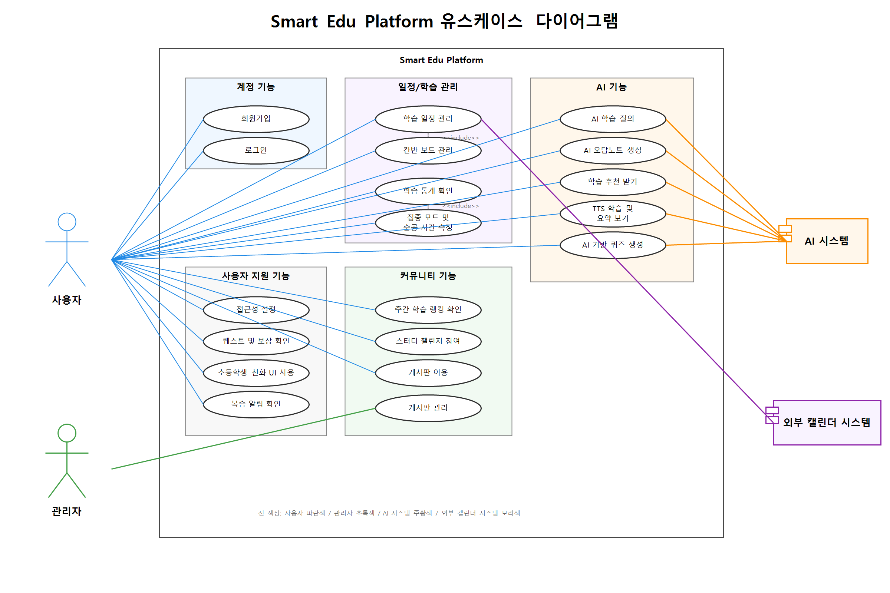

# Smart Edu Platform 요구사항 문서

## 문서 정보

| 항목 | 내용 |
|---|---|
| 과목 | 소프트웨어공학 |
| 조 | 15조 |
| 프로젝트명 | Smart Edu Platform |
| 선정 주제 | 주제 1. 개인화된 학습 관리 앱 |
| 조원 | 정이량, 황대겸, 박지환 |
| 작성일 | 2026년 05월 |

---

## 목차

1. [문서 개요](#1-문서-개요)
   - [1.1 문서 목적](#11-문서-목적)
   - [1.2 문서 작성 기준](#12-문서-작성-기준)
   - [1.3 요구사항 문서 범위](#13-요구사항-문서-범위)
   - [1.4 참고 문서](#14-참고-문서)
   - [1.5 ID 체계](#15-id-체계)
2. [요구사항 도출 방법](#2-요구사항-도출-방법)
3. [사용자 그룹 및 페르소나 요약](#3-사용자-그룹-및-페르소나-요약)
4. [고객 관점 요구사항](#4-고객-관점-요구사항)
   - [4.1 최종 사용자 요구사항](#41-최종-사용자-요구사항)
   - [4.2 서비스 의뢰자 및 이해관계자 요구사항](#42-서비스-의뢰자-및-이해관계자-요구사항)
5. [기능 요구사항 명세](#5-기능-요구사항-명세)
6. [비기능 요구사항 명세](#6-비기능-요구사항-명세)
7. [유스케이스 다이어그램](#7-유스케이스-다이어그램)
8. [요구사항 추적표](#8-요구사항-추적표)
   - [8.1 최종 사용자 및 시스템 직접 사용자 요구사항 추적표](#81-최종-사용자-및-시스템-직접-사용자-요구사항-추적표)
   - [8.2 서비스 의뢰자 및 이해관계자 요구사항 추적표](#82-서비스-의뢰자-및-이해관계자-요구사항-추적표)
9. [부록 문서](#9-부록-문서)

---

# 1. 문서 개요

## 1.1 문서 목적

본 문서는 **Smart Edu Platform**의 요구사항을 명확히 정의하기 위한 문서이다.

본 문서에서는 회의록, 잠재 사용자 인터뷰, 서비스 의뢰자/이해관계자 관점 분석, AI 기반 가상 인터뷰 시뮬레이션 결과를 바탕으로 사용자 요구사항, 기능 요구사항, 비기능 요구사항, 유스케이스 후보를 정리한다.

본 프로젝트에서 고객은 Smart Edu Platform을 직접 사용하는 최종 사용자뿐 아니라, 해당 서비스를 기획·의뢰·운영·관리하는 사람 또는 조직까지 포함한다.

또한 이후 작성할 설계 문서, 테스트 보고서, 최종 보고서에서 요구사항을 추적할 수 있도록 요구사항 ID와 유스케이스 ID를 함께 정의한다.

---

## 1.2 문서 작성 기준

본 요구사항 문서는 ISO/IEC/IEEE 29148 요구사항 공학 표준에서 다루는 요구사항 산출물 작성 원칙을 수업 조별 프로젝트 범위에 맞게 참고하여 작성함.

본 문서는 표준의 모든 항목을 그대로 적용하는 문서가 아니라, 과제 범위에 맞춰 다음 내용을 중심으로 정리함.

- 고객 및 이해관계자 정의
- 요구사항 도출 근거
- 고객 관점 요구사항(최종 사용자 요구사항, 서비스 의뢰자 및 이해관계자 요구사항)
- 기능 요구사항
- 비기능 요구사항
- 유스케이스
- 요구사항 추적 관계

---

## 1.3 요구사항 문서 범위

본 문서는 다음 내용을 포함한다.

- 사용자 그룹 및 페르소나 요약
- 사용자 요구사항
- 기능 요구사항
- 비기능 요구사항
- 주요 액터 및 유스케이스 목록
- 유스케이스 다이어그램
- 요구사항 추적표

상세 인터뷰 응답과 AI 활용 과정은 부록 문서로 분리하고, 본문에는 요구사항 도출 근거의 요약과 요구사항 간 추적 관계를 중심으로 정리한다.

---

## 1.4 참고 문서

| 문서명 | 경로 | 설명 |
|---|---|---|
| 2026-05-06 회의록 | `docs/meeting-minutes/meeting-2026-05-06.md` | 주제 선정, 요구사항 분석 방식, 타겟 그룹 도출 |
| 2026-05-11 회의록 | `docs/meeting-minutes/meeting-2026-05-11.md` | 구현 방향, 기능 후보, 기능/비기능 요구사항 후보 정리 |
| 잠재 사용자 인터뷰 시뮬레이션 문서 | [docs/requirements/ai-user-interview-simulation.md](./ai-user-interview-simulation.md) | 최종 사용자 관점 인터뷰 근거 |
| 서비스 의뢰자 인터뷰 시뮬레이션 문서 | [docs/requirements/ai-client-interview-simulation.md](./ai-client-interview-simulation.md) | 의뢰자 및 이해관계자 관점 인터뷰 근거 |
| AI 시뮬레이션 로그 | [docs/requirements/ai-simulation-log.md](./ai-simulation-log.md) | AI 활용 과정 요약 |
| 유스케이스 다이어그램 이미지 | [screenshots/usecase-diagram.png](../../screenshots/usecase-diagram.png) | 렌더링된 유스케이스 다이어그램 이미지 |
| 유스케이스 다이어그램 PlantUML 원본 | [docs/requirements/usecase-diagram.puml](./usecase-diagram.puml) | 유스케이스 다이어그램 원본 코드 |

---

## 1.5 ID 체계

요구사항과 유스케이스를 추적하기 위해 다음 ID 체계를 사용한다.

| ID 유형 | 의미 | 예시 |
|---|---|---|
| `P` | 페르소나(최종 사용자 및 서비스 의뢰자/이해관계자) | `P-01` |
| `UR` | 사용자 요구사항 | `UR-01` |
| `FR` | 기능 요구사항 | `FR-01` |
| `NFR` | 비기능 요구사항 | `NFR-01` |
| `UC` | 유스케이스 | `UC-01` |

---

# 2. 요구사항 도출 방법

## 2.1 요구사항 도출 개요

본 프로젝트에서는 실제 사용자가 느끼는 불편함과 요구사항을 반영하기 위해 다음 방식으로 요구사항을 도출하였다.

| 도출 방법 | 설명 |
|---|---|
| 회의 기반 분석 | 조원 회의를 통해 주제 선정, 구현 방향, 기능 후보를 정리 |
| AI 기반 가상 인터뷰 | 다양한 사용자 집단을 대상으로 한 가상 설문/인터뷰 시뮬레이션 수행 |
| 서비스 의뢰자/이해관계자 관점 분석 | 서비스를 기획하거나 개발을 의뢰하는 이해관계자의 관점에서 운영성, 확장성, 수요, 관리 기능, 보안 요구 확인 |
| 페르소나 분석 | 대표 사용자를 설정하고 사용자별 핵심 니즈와 요구 기능 도출 |
| 문서 분석 | 과제 안내 자료와 프로젝트 요구사항을 분석하여 필수 구현 범위 확인 |
| 워크샵 | 조원 간 기능 우선순위와 구현 가능성을 논의 |
| 사용자 스토리 및 시나리오 | 사용자 입장에서 필요한 기능을 기능 요구사항으로 확장 |

---

## 2.2 요구사항 분석 절차

요구사항 분석은 다음 순서로 진행하였다.

1. 프로젝트 주제 선정
2. 사용자 그룹 분류
3. 페르소나 설정
4. AI 기반 잠재 사용자 인터뷰 및 설문조사 진행
5. 서비스 의뢰자 및 이해관계자 관점 분석
6. 사용자 문제점 및 핵심 니즈 정리
7. 최종 사용자 및 서비스 의뢰자/이해관계자 요구사항 도출
8. 기능 요구사항 및 비기능 요구사항 정리
9. 유스케이스 후보 도출
10. 설계 문서와 테스트 문서에서 활용할 요구사항 ID 부여

---

# 3. 사용자 그룹 및 페르소나 요약

## 3.1 사용자 그룹 요약

| 사용자 그룹 | 핵심 니즈 | 대표 기능 |
|---|---|---|
| 초등학생 | 흥미와 보상 | 퀘스트, 뱃지, 포인트, 아이콘 중심 UI |
| 중학생 | 소셜과 경쟁 | 주간 학습 랭킹, 스터디 챌린지 |
| 고등학생 | 효율과 AI 분석 | AI 오답노트, 유사 문제 생성, 시험 대비 스케줄러 |
| 대학생/취준생 | 일정 및 태스크 관리 | 칸반 보드, 캘린더 연동, 마감일 관리 |
| 공시생/고시생 | 장시간 집중과 기록 | 앱 차단 모드, 순공 스톱워치, 히트맵 |
| 직장인 | 자투리 시간 활용 | TTS, 요약, 짧은 학습 카드 |
| 시니어 학습자 | 접근성과 반복 학습 | 큰 글씨, 고대비 UI, 음성 입력, 복습 알림 |

---

## 3.2 페르소나 요약

| 페르소나 ID | 사용자 그룹 | 이름 | 나이 | 공부 대상 | 핵심 니즈 |
|---|---|---|---:|---|---|
| P-01 | 초등학생 | 이민준 | 11 | 학교 숙제, 구구단, 기초 영단어 | 자발적 참여 유도 및 흥미 유발 |
| P-02 | 중학생 | 박수진 | 15 | 중등 내신, 수행평가 | 또래와의 경쟁 및 학습 습관 형성 |
| P-03 | 고등학생 | 최지우 | 18 | 수능, 모의고사, 학교 내신 | 취약점 분석과 효율적 시험 대비 |
| P-04 | 대학생/취준생 | 김태현 | 24 | 전공 과제, 토익, 자격증, 인턴 준비 | 다중 일정 및 프로젝트 관리 |
| P-05 | 공시생/고시생 | 정우진 | 28 | 공무원 시험, 장기 시험 준비 | 순공 시간 기록과 장기 집중 |
| P-06 | 직장인 | 강지혜 | 34 | 직무 강의, 비즈니스 회화 | 출퇴근 및 자투리 시간 학습 |
| P-07 | 시니어 학습자 | 오영석 | 65 | 스마트폰 활용법, 디지털 문해력, 생활 영어 | 쉬운 사용성과 반복 학습 |

---

## 3.3 서비스 의뢰자 및 이해관계자 관점 요약

서비스 의뢰자 및 이해관계자 관점은 새 기능 추가가 아니라 기존 요구사항의 타당성, 우선순위, 운영성, 확장성, 보안성을 검토하기 위한 보조 근거로 사용한다.

인터뷰 규모는 다음과 같이 정리한다.

| 구분 | 규모 | 목적 |
|---|---:|---|
| 잠재 사용자 인터뷰 | 7개 사용자 그룹 × 15명 | 실제 사용자 니즈와 기능 우선순위 확인 |
| 공식 의뢰자 | 1명 | 학습 관리 플랫폼 시범사업의 방향성과 운영 요구 확인 |
| 이해관계자 인터뷰 | 5개 관점 × 4명 | 운영성, 확장성, 보안성, 사업성 검토 |

공식 의뢰자는 **공공·평생교육기관 기반 디지털 학습 관리 플랫폼 시범사업 책임자**로 설정한다.

서비스 의뢰자 및 이해관계자는 시스템을 직접 사용하는 주액터가 아니라 요구사항 도출 근거를 제공하는 운영 관점 이해관계자이다. 따라서 아래 `P-08`~`P-13`은 유스케이스 다이어그램의 액터가 아니라 의뢰자/이해관계자 페르소나로 사용한다.

`P-08`~`P-13`은 최종 사용자 페르소나와 동일한 직접 사용자 그룹이 아니라 서비스 운영·기획·보안·사업 관점의 요구사항 근거를 제공하는 페르소나이다. 특히 `P-11` 학습 플랫폼 관리자는 유스케이스의 `관리자` 액터가 수행하는 기능 요구의 운영 근거를 제공하지만, 다이어그램의 새 액터를 의미하지 않는다.

| 관점 ID | 의뢰자/이해관계자 유형 | 역할 | 핵심 목표 | 주요 요구 | 우려 사항 | 연결 요구사항 |
|---|---|---|---|---|---|---|
| P-08 | 공식 의뢰자 | 공공·평생교육기관 기반 디지털 학습 관리 플랫폼 시범사업 책임자 | 특정 연령층에 치우치지 않는 통합 학습 관리 환경 확보 | 사용자 유형별 기능 제공, 웹/모바일 지원, 장기 학습 기록 보존 | 기능이 흩어져 학습 계획-기록-복습 흐름이 약해지는 문제 | FR-23, NFR-09, NFR-11 |
| P-09 | 서비스 기획자 | MVP 범위와 화면 흐름을 조정하는 기획 담당자 | 사용자 유형별 핵심 기능 우선순위를 정하고 초기 사용 흐름을 단순화 | 일정, 태스크, AI 질의, 집중 기록을 하나의 학습 흐름으로 연결 | 기능을 넓게 넣기만 해 사용자가 필요한 기능을 찾기 어려워지는 문제 | FR-23, NFR-10 |
| P-10 | 교육기관/학원 운영자 | 학습자의 참여 지속성과 수업 외 복습을 관리하는 운영자 | 학습자가 수업 밖에서도 복습하고 챌린지와 보상으로 학습을 지속하도록 유도 | 보상, 스터디 챌린지, 주기적 복습 알림, 학습 기록 시각화 | 보상이 학습 목표와 분리되거나 알림이 과도해 사용자가 이탈하는 문제 | FR-12, FR-24, FR-26 |
| P-11 | 학습 플랫폼 관리자 | 게시판, 신고, 사용자 제재, 챌린지 운영을 관리하는 관리자 | 커뮤니티와 챌린지 품질을 유지하고 관리자 조치 이력을 추적 | 게시글/댓글 신고 처리, 사용자 계정 제재, 챌린지 관리, 권한 분리 | 일반 사용자 기능과 관리자 기능이 섞여 권한 오류와 오조작이 생기는 문제 | FR-27, FR-28, FR-29 |
| P-12 | 데이터/보안 담당자 | 개인정보, 인증, 권한, 학습 기록 신뢰성을 검토하는 담당자 | 사용자의 계정 정보와 학습 데이터가 안전하고 일관되게 관리되도록 보장 | 비밀번호 암호화, 개인정보 보호, 동의 기반 권한 요청, 학습 기록 보존 | 학습 기록과 활동 로그가 외부에 노출되거나 기능별로 흩어져 신뢰성이 낮아지는 문제 | NFR-02, NFR-03, NFR-07, NFR-12 |
| P-13 | 에듀테크 사업 책임자 | AI 기능의 차별성과 서비스 확장성을 검토하는 사업 책임자 | AI 기능을 단순 답변이 아닌 학습 효과와 서비스 차별성으로 연결 | AI 질의, AI 오답노트, 학습 추천, 퀴즈 생성, 요약 | AI 결과가 학습 보조 흐름과 연결되지 않거나 초기 구조가 확장에 취약해지는 문제 | FR-07, FR-08, FR-09, FR-10, FR-19 |

---

# 4. 고객 관점 요구사항

본 문서의 고객은 최종 사용자뿐 아니라 서비스를 기획·의뢰·운영·관리하는 조직과 이해관계자까지 포함한다. 따라서 고객 관점 요구사항은 실제 학습자가 시스템에서 기대하는 `최종 사용자 요구사항`과 운영·기획·보안·사업 관점에서 도출한 `서비스 의뢰자 및 이해관계자 요구사항`으로 구분한다.

서비스 의뢰자 및 이해관계자 요구사항은 유스케이스 액터를 새로 추가하기 위한 항목이 아니라, 기존 FR/NFR/UC의 필요성과 우선순위를 보강하기 위한 근거이다.

## 4.1 최종 사용자 요구사항

최종 사용자 요구사항은 실제 학습자가 시스템에서 기대하는 기능과 품질을 정리한 항목이다. 잠재 사용자 인터뷰 시뮬레이션과 페르소나 `P-01`~`P-07`을 근거로 한다.

| 사용자 요구사항 ID | 사용자 요구사항명 | 설명 | 관련 페르소나 |
|---|---|---|---|
| UR-01 | 사용자 인증 | 사용자는 자신의 계정을 생성하고 로그인할 수 있어야 한다. | 전체 사용자 |
| UR-02 | 학습 일정 관리 | 사용자는 학습 일정을 등록하고 관리할 수 있어야 한다. | P-03, P-04 |
| UR-03 | 태스크 관리 | 사용자는 할 일을 상태별로 관리하고 진행 상황을 확인할 수 있어야 한다. | P-04 |
| UR-04 | AI 학습 지원 | 사용자는 AI를 활용해 질문, 오답 정리, 학습 추천을 받을 수 있어야 한다. | P-03, P-04 |
| UR-05 | 오답 관리 | 사용자는 틀린 문제와 취약 유형을 정리하고 복습할 수 있어야 한다. | P-03 |
| UR-06 | 소셜 학습 | 사용자는 친구와 함께 공부하거나 학습 시간을 비교할 수 있어야 한다. | P-02 |
| UR-07 | 커뮤니티 이용 | 사용자는 질문, 자유, 학습 인증 게시판을 이용할 수 있어야 한다. | P-02, P-04 |
| UR-08 | 집중 관리 | 사용자는 공부 중 방해 요소를 줄이고 순공 시간을 기록할 수 있어야 한다. | P-05 |
| UR-09 | 학습 데이터 확인 | 사용자는 자신의 학습 시간, 진척도, 통계를 확인할 수 있어야 한다. | P-03, P-05 |
| UR-10 | 음성 학습 | 사용자는 텍스트 학습 내용을 음성으로 들을 수 있어야 한다. | P-06 |
| UR-11 | 접근성 설정 | 사용자는 큰 글씨, 고대비 화면 등 접근성 기능을 사용할 수 있어야 한다. | P-07 |
| UR-12 | 데이터 보호 | 사용자는 자신의 개인정보와 학습 데이터를 안전하게 보호받을 수 있어야 한다. | 전체 사용자 |
| UR-13 | 학습 흥미 및 보상 | 사용자는 학습 수행 결과에 따라 보상과 피드백을 받을 수 있어야 한다. | P-01 |
| UR-14 | 반복 복습 | 사용자는 학습 내용을 잊어버릴 시점에 다시 복습할 수 있도록 알림을 받을 수 있어야 한다. | P-07 |

## 4.2 서비스 의뢰자 및 이해관계자 요구사항

다음 요구사항은 `ai-client-interview-simulation.md`를 근거로 서비스 의뢰자 및 이해관계자 관점에서 도출한 운영·기획·보안·사업 요구사항이다. `UR-15`~`UR-20`은 새 유스케이스 액터를 추가하기 위한 항목이 아니라 기존 FR/NFR/UC의 필요성, 우선순위, 운영 기준을 보강하기 위한 요구사항이다. `P-08`~`P-13`은 의뢰자/이해관계자 페르소나이며 시스템 직접 액터가 아니다.

| 사용자 요구사항 ID | 사용자 요구사항명 | 설명 | 관련 페르소나 |
|---|---|---|---|
| UR-15 | 전 연령층을 포괄하는 통합 학습 관리 | 의뢰자는 초등학생부터 시니어 학습자까지 같은 플랫폼에서 각자의 학습 목적에 맞게 일정, 기록, 복습, 커뮤니티 기능을 사용할 수 있기를 요구한다. | P-08 |
| UR-16 | 사용자 유형별 기능 우선순위와 MVP 운영 | 서비스 기획자는 초기 MVP에서 기능을 넓게 나열하기보다 사용자 유형별 핵심 기능과 학습 계획-실행-기록 흐름이 직관적으로 연결되기를 요구한다. | P-09 |
| UR-17 | 학습 지속성 강화를 위한 복습·보상·챌린지 운영 | 교육기관/학원 운영자는 학습자가 수업 밖에서도 다시 복습하고, 보상과 챌린지를 통해 학습 참여를 지속할 수 있기를 요구한다. | P-10 |
| UR-18 | 게시판·신고·사용자 제재·챌린지 운영 관리 | 학습 플랫폼 관리자는 게시판과 챌린지 운영 중 발생하는 신고, 부적절한 게시물, 사용자 제재를 관리자 권한과 처리 기록 기반으로 관리할 수 있기를 요구한다. | P-11 |
| UR-19 | 개인정보 보호·인증·권한·데이터 신뢰성 확보 | 데이터/보안 담당자는 계정 정보, 학습 기록, 활동 로그가 안전하게 보호되고 인증·권한·데이터 보존 기준이 일관되게 적용되기를 요구한다. | P-12 |
| UR-20 | AI 기능의 학습 효과와 서비스 차별성 확보 | 에듀테크 사업 책임자는 AI 질의, 오답노트, 학습 추천, 퀴즈 생성, 요약 기능이 단순 응답을 넘어 학습 효과와 서비스 차별성으로 연결되기를 요구한다. | P-13 |

---

# 5. 기능 요구사항 명세

기능 요구사항은 시스템이 제공해야 하는 구체적인 기능을 정의한 것이다.

| 요구사항 ID | 요구사항명 | 상세 설명 | 필수 데이터 | 선택 데이터 |
|---|---|---|---|---|
| FR-01 | 회원가입/로그인 | 사용자는 이메일과 비밀번호를 통해 회원가입 및 로그인을 할 수 있어야 한다. | 이메일, 비밀번호, 이름 | 프로필 이미지, 학습 목적 |
| FR-02 | 사용자 프로필 관리 | 시스템은 사용자 정보를 저장하고, 사용자가 자신의 학습 목적과 기본 정보를 수정할 수 있도록 해야 한다. | 사용자 ID, 이름, 이메일 | 학습 목표, 프로필 이미지, 사용자 유형 |
| FR-03 | 학습 일정 관리 | 사용자는 학습 일정을 캘린더에 등록, 수정, 삭제하고 마감일을 확인할 수 있어야 한다. | 일정명, 날짜, 시간 | 과목, 중요도, 반복 여부, 메모 |
| FR-04 | 칸반 보드 | 사용자는 학습 태스크를 `할 일`, `진행 중`, `완료` 상태로 관리할 수 있어야 한다. | 태스크명, 상태 | 마감일, 우선순위, 메모 |
| FR-05 | 마감일 알림 | 시스템은 마감일이 임박한 학습 일정이나 태스크에 대해 알림을 제공해야 한다. | 일정 ID, 마감일, 사용자 ID | 알림 시간, 반복 알림 여부 |
| FR-06 | 학습 노트 | 사용자는 학습 노트를 작성, 수정, 삭제, 조회할 수 있어야 한다. | 노트 제목, 노트 내용, 사용자 ID | 과목, 태그, 첨부 이미지 |
| FR-07 | AI 학습 질의 | 사용자는 AI에게 학습 관련 질문을 입력하고 답변을 받을 수 있어야 한다. | 질문 내용, 사용자 ID | 과목, 이전 질문 기록 |
| FR-08 | AI 오답노트 | 시스템은 사용자의 오답 또는 프롬프트 히스토리를 기반으로 오답노트를 생성할 수 있어야 한다. | 문제 내용, 사용자 입력, 사용자 ID | 이미지, 해설, 과목, 난이도 |
| FR-09 | AI 학습 추천 | 시스템은 사용자 성적 및 오답 데이터를 기반으로 취약 과목이나 취약 유형을 추천할 수 있어야 한다. | 오답 데이터, 학습 기록, 사용자 ID | 성적 데이터, 과목별 목표 점수 |
| FR-10 | AI 기반 퀴즈 생성 | 시스템은 사용자의 학습 노트나 오답 데이터를 기반으로 복습용 퀴즈를 생성할 수 있어야 한다. | 노트 내용 또는 오답 내용 | 문제 수, 난이도, 과목 |
| FR-11 | 주간 학습 랭킹 | 사용자는 친구 또는 그룹 내 주간 학습 시간 순위를 확인할 수 있어야 한다. | 사용자 ID, 학습 시간 | 그룹 ID, 공개 범위 |
| FR-12 | 스터디 챌린지 | 사용자는 친구와 함께 학습 목표를 설정하고 챌린지에 참여할 수 있어야 한다. | 챌린지명, 목표, 참여자 | 기간, 보상, 공개 범위 |
| FR-13 | 카테고리별 게시판 | 사용자는 질문, 자유, 학습 인증 게시판을 이용할 수 있어야 한다. | 게시글 제목, 내용, 작성자 | 이미지, 태그, 댓글 |
| FR-14 | 앱 차단 모드 | 사용자는 공부 시간 동안 특정 앱 또는 알림을 차단할 수 있어야 한다. | 차단 대상, 차단 시간, 사용자 ID | 차단 예외 앱, 해제 조건 |
| FR-15 | 스톱워치/타이머 | 사용자는 스톱워치와 타이머를 이용하여 실제 공부 시간을 측정할 수 있어야 한다. | 시작 시간, 종료 시간, 학습 시간 | 과목, 메모, 목표 시간 |
| FR-16 | 학습 데이터 시각화 | 시스템은 학습 시간, 진척도, 과목별 기록을 그래프나 통계 형태로 제공해야 한다. | 학습 시간, 사용자 ID | 과목, 기간, 목표 달성률 |
| FR-17 | 학습 히트맵 | 시스템은 장기 학습 기록을 히트맵 형태로 시각화할 수 있어야 한다. | 날짜별 학습 시간 | 과목별 필터, 목표 달성 여부 |
| FR-18 | 텍스트 읽어주기 | 시스템은 사용자가 작성한 학습 내용을 음성으로 변환하여 제공할 수 있어야 한다. | 텍스트 내용 | 음성 속도, 음성 종류 |
| FR-19 | 학습 내용 요약 | 시스템은 긴 학습 노트나 자료를 짧게 요약하여 제공할 수 있어야 한다. | 원문 텍스트 | 요약 길이, 핵심 키워드 |
| FR-20 | 큰 글씨/고대비 모드 | 사용자는 큰 글씨 모드와 고대비 모드를 설정할 수 있어야 한다. | 사용자 ID, 설정값 | 테마 색상, 글자 크기 |
| FR-21 | STT 기반 노트 작성 | 사용자는 음성 입력을 통해 학습 메모나 노트를 작성할 수 있어야 한다. | 음성 입력 데이터 | 변환 언어, 수정 내용 |
| FR-22 | 외부 캘린더 연동 | 시스템은 외부 캘린더와 학습 일정을 연동할 수 있어야 한다. | 일정 정보, 사용자 계정 | 연동 서비스 종류 |
| FR-23 | 사용자 유형별 기능 제공 | 시스템은 사용자 유형에 따라 우선적으로 보여줄 기능을 다르게 제공할 수 있어야 한다. | 사용자 유형, 사용자 ID | 학습 목적, 사용 이력 |
| FR-24 | 퀘스트/뱃지/포인트 | 사용자는 학습 목표를 달성하면 포인트와 뱃지를 받을 수 있어야 한다. | 사용자 ID, 학습 완료 기록 | 뱃지 종류, 포인트 내역, 보상 조건 |
| FR-25 | 아이콘 중심 UI | 시스템은 초등학생 사용자를 위해 아이콘 중심의 직관적인 화면을 제공할 수 있어야 한다. | 사용자 유형 | 테마, 캐릭터 설정, 화면 모드 |
| FR-26 | 주기적 복습 알림 | 시스템은 사용자의 학습 기록을 기반으로 일정 시간이 지난 뒤 복습 알림을 제공할 수 있어야 한다. | 사용자 ID, 학습 기록, 학습 날짜 | 복습 주기, 알림 시간 |
| FR-27 | 게시판 운영 관리 | 관리자는 게시글, 댓글, 신고된 게시물을 확인하고 관리할 수 있어야 한다. | 관리자 ID, 게시글 ID | 신고 내역, 처리 상태 |
| FR-28 | 사용자 계정 관리 및 제재 | 관리자는 부적절한 사용자 계정을 확인하고 제재할 수 있어야 한다. | 관리자 ID, 사용자 ID | 제재 사유, 제재 기간 |
| FR-29 | 스터디 챌린지 관리 | 관리자는 부적절한 스터디 챌린지를 확인하고 관리할 수 있어야 한다. | 관리자 ID, 챌린지 ID | 처리 사유, 처리 상태 |

---

# 6. 비기능 요구사항 명세

비기능 요구사항은 시스템의 품질, 성능, 보안, 접근성, 유지보수성 등 기능 외적인 요구사항을 정의한 것이다.

| 요구사항 ID | 구분 | 비기능 요구사항 | 상세 설명 |
|---|---|---|---|
| NFR-01 | 성능 | 주요 기능 응답 시간 | 사용자가 일정 등록, 게시글 작성, 노트 저장 등 주요 CRUD 기능을 수행했을 때 2초 이내 응답을 목표로 한다. |
| NFR-02 | 보안 | 비밀번호 암호화 | 사용자 비밀번호는 평문으로 저장하지 않고 암호화하여 저장해야 한다. |
| NFR-03 | 보안 | 개인정보 보호 | 사용자 개인정보와 학습 데이터는 외부에 노출되지 않도록 보호해야 한다. |
| NFR-04 | 가용성 | 서비스 가동률 | 시스템은 정기 점검 시간을 제외하고 99% 이상의 가동률을 목표로 한다. |
| NFR-05 | 백업 및 복구 | 데이터 복구 가능성 | 사용자 회원정보와 학습 데이터는 DBMS 기반으로 관리하며, 장애 발생 시 복구할 수 있어야 한다. |
| NFR-06 | 접근성 | 큰 글씨 및 고대비 지원 | 시니어 사용자를 포함한 다양한 사용자가 큰 글씨 모드와 고대비 모드를 사용할 수 있어야 한다. |
| NFR-07 | 권한 관리 | 사용자 동의 기반 권한 요청 | 시스템은 카메라, 캘린더, 파일 및 미디어 등 민감한 권한을 사용자 동의 후 요청해야 한다. |
| NFR-08 | 유지보수성 | 정기 점검 및 점검 화면 | 서버 점검은 매주 수요일 00:00~01:30에 수행하며, 점검 중에는 점검 화면을 제공해야 한다. |
| NFR-09 | 확장성 | 기능 모듈화 | 향후 새로운 학습 유형과 사용자 그룹을 추가할 수 있도록 기능을 모듈화해야 한다. |
| NFR-10 | 사용성 | 직관적인 사용 흐름 | 사용자는 주요 기능을 복잡한 절차 없이 직관적으로 사용할 수 있어야 한다. |
| NFR-11 | 호환성 | 웹/모바일 사용 지원 | 시스템은 웹과 모바일 환경에서 사용할 수 있도록 설계되어야 한다. |
| NFR-12 | 데이터 신뢰성 | 학습 기록 보존 | 사용자의 학습 기록, 순공 시간, 오답 데이터는 손실되지 않도록 안정적으로 저장되어야 한다. |

---

# 7. 유스케이스 다이어그램

## 7.1 유스케이스 다이어그램

Smart Edu Platform의 주요 액터와 시스템 기능 간의 관계는 다음 유스케이스 다이어그램과 같다.

| 산출물 | 설명 |
|---|---|
| 유스케이스 다이어그램 | Smart Edu Platform의 주액터, 부액터, 주요 유스케이스 관계를 시각화한 다이어그램임. |
| 이미지 | [screenshots/usecase-diagram.png](../../screenshots/usecase-diagram.png) |
| 원본 | [docs/requirements/usecase-diagram.puml](./usecase-diagram.puml) |

---

## 7.2 주요 액터

본 프로젝트의 액터는 시스템을 직접 사용하는 **주액터**와, 특정 기능 수행을 보조하는 **부액터**로 구분한다.

### 7.2.1 주액터

| 액터 | 설명 |
|---|---|
| 사용자 | Smart Edu Platform을 사용하는 일반 학습자 |
| 관리자 | 사용자 계정, 게시판, 스터디 챌린지 등 시스템 운영 요소를 관리하는 사용자 |

### 7.2.2 부액터

| 액터 | 설명 |
|---|---|
| AI 시스템 | 질의응답, 오답노트, 추천, 퀴즈 생성, 요약 기능을 지원하는 외부 또는 내부 AI 기능 |
| 외부 캘린더 시스템 | 학습 일정을 외부 캘린더와 연동하는 시스템 |

---

## 7.3 주요 유스케이스 목록

| 유스케이스 ID | 유스케이스명 | 주액터 | 부액터 |
|---|---|---|---|
| UC-01 | 회원가입 | 사용자 | - |
| UC-02 | 로그인 | 사용자 | - |
| UC-03 | 학습 일정 관리 | 사용자 | 외부 캘린더 시스템 |
| UC-04 | 칸반 보드 관리 | 사용자 | - |
| UC-05 | AI 학습 질의 | 사용자 | AI 시스템 |
| UC-06 | AI 오답노트 생성 | 사용자 | AI 시스템 |
| UC-07 | 학습 추천 받기 | 사용자 | AI 시스템 |
| UC-08 | 주간 학습 랭킹 확인 | 사용자 | - |
| UC-09 | 스터디 챌린지 참여 | 사용자 | - |
| UC-10 | 게시판 이용 | 사용자 | - |
| UC-11 | 학습 통계 확인 | 사용자 | - |
| UC-12 | 집중 모드 및 순공 시간 측정 | 사용자 | - |
| UC-13 | TTS 학습 및 요약 보기 | 사용자 | AI 시스템 |
| UC-14 | 접근성 설정 | 사용자 | - |
| UC-15 | 퀘스트 및 보상 확인 | 사용자 | - |
| UC-16 | 초등학생 친화 UI 사용 | 사용자 | - |
| UC-17 | 복습 알림 확인 | 사용자 | - |
| UC-18 | 게시판 관리 | 관리자 | - |
| UC-19 | AI 기반 퀴즈 생성 | 사용자 | AI 시스템 |
| UC-20 | 사용자 계정 관리 및 제재 | 관리자 | - |
| UC-21 | 스터디 챌린지 관리 | 관리자 | - |

---

# 8. 요구사항 추적표

요구사항 추적표는 페르소나, 고객 관점 요구사항, 기능/비기능 요구사항, 유스케이스 간의 연결 관계를 나타낸다. 본 문서에서는 가독성을 위해 최종 사용자 및 시스템 직접 사용자 관점과 서비스 의뢰자 및 이해관계자 관점을 구분하여 제시한다.

## 8.1 최종 사용자 및 시스템 직접 사용자 요구사항 추적표

| 페르소나 ID | 사용자 그룹 | 사용자 요구사항 ID | 기능/비기능 요구사항 ID | 유스케이스 ID |
|---|---|---|---|---|
| P-01 | 초등학생 | UR-13 | FR-24, FR-25 | UC-15, UC-16 |
| P-02 | 중학생 | UR-06 | FR-11, FR-12 | UC-08, UC-09 |
| P-02 | 중학생 | UR-07 | FR-13 | UC-10 |
| P-03 | 고등학생 | UR-04 | FR-07, FR-09 | UC-05, UC-07 |
| P-03 | 고등학생 | UR-04 | FR-10 | UC-19 |
| P-03 | 고등학생 | UR-05 | FR-08 | UC-06 |
| P-04 | 대학생/취준생 | UR-02 | FR-03, FR-05, FR-22 | UC-03 |
| P-04 | 대학생/취준생 | UR-03 | FR-04 | UC-04 |
| P-05 | 공시생/고시생 | UR-08 | FR-14, FR-15 | UC-12 |
| P-05 | 공시생/고시생 | UR-09 | FR-16, FR-17 | UC-11 |
| P-06 | 직장인 | UR-10 | FR-18, FR-19 | UC-13 |
| P-07 | 시니어 학습자 | UR-11 | FR-20, FR-21 | UC-14 |
| P-07 | 시니어 학습자 | UR-14 | FR-26 | UC-17 |
| 전체 사용자 | 공통 | UR-01 | FR-01, FR-02 | UC-01, UC-02 |
| 전체 사용자 | 공통 | UR-12 | NFR-02, NFR-03, NFR-07 | - |
| 관리자 | 공통 | - | FR-27 | UC-18 |
| 관리자 | 공통 | - | FR-28 | UC-20 |
| 관리자 | 공통 | - | FR-29 | UC-21 |

## 8.2 서비스 의뢰자 및 이해관계자 요구사항 추적표

다음 표는 서비스 운영·기획·보안·사업 관점에서 도출한 요구사항과 기존 FR/NFR/UC의 연결 관계를 나타낸다. `P-11` 학습 플랫폼 관리자는 운영 이해관계자 페르소나이며, 유스케이스의 `관리자` 액터가 수행하는 기능 요구의 운영 근거를 제공한다.

| 페르소나 ID | 이해관계자 유형 | 사용자 요구사항 ID | 기능/비기능 요구사항 ID | 유스케이스 ID |
|---|---|---|---|---|
| P-08 | 공식 의뢰자 | UR-15 | FR-23, NFR-09, NFR-11 | - |
| P-09 | 서비스 기획자 | UR-16 | FR-23, NFR-10 | - |
| P-10 | 교육기관/학원 운영자 | UR-17 | FR-12, FR-24, FR-26 | UC-09, UC-15, UC-17 |
| P-11 | 학습 플랫폼 관리자 | UR-18 | FR-27, FR-28, FR-29 | UC-18, UC-20, UC-21 |
| P-12 | 데이터/보안 담당자 | UR-19 | NFR-02, NFR-03, NFR-07, NFR-12 | - |
| P-13 | 에듀테크 사업 책임자 | UR-20 | FR-07, FR-08, FR-09, FR-10, FR-19 | UC-05, UC-06, UC-07, UC-19 |

---

# 9. 부록 문서

- 요구사항 도출 근거
  - [잠재 사용자 인터뷰 시뮬레이션 문서](./ai-user-interview-simulation.md)
  - [서비스 의뢰자 인터뷰 시뮬레이션 문서](./ai-client-interview-simulation.md)
  - [AI 시뮬레이션 로그](./ai-simulation-log.md)

- 유스케이스 다이어그램
  - [유스케이스 다이어그램 이미지](../../screenshots/usecase-diagram.png)
  - [유스케이스 다이어그램 PlantUML 원본](./usecase-diagram.puml)
